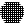

#### Component list:
*  [Butterfly](../components/Butterfly.md)
*  [Create_Case_from_Folder](../components/Create_Case_from_Folder.md)
*  [Create_Butterfly_Geometry](../components/Create_Butterfly_Geometry.md)
*  [Create_Case_from_Geometries](../components/Create_Case_from_Geometries.md)
*  [Create_Case_from_Tunnel](../components/Create_Case_from_Tunnel.md)
*  [Wind_Tunnel_Parameters](../components/Wind_Tunnel_Parameters.md)
*  [Wind_Vector](../components/Wind_Vector.md)
*  [Make2d_Parameters](../components/Make2d_Parameters.md)
*  [Meshing_Parameters](../components/Meshing_Parameters.md)
*  [Refinement_Region](../components/Refinement_Region.md)
*  [Update_blockMeshDict](../components/Update_blockMeshDict.md)
*  [DistanceRefinementMode](../components/DistanceRefinementMode.md)
*  [LocationRefinementMode](../components/LocationRefinementMode.md)