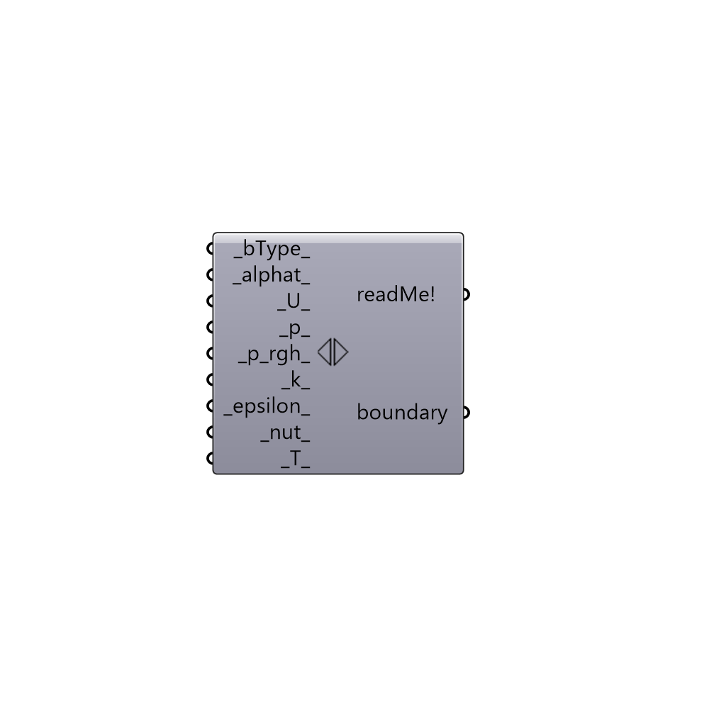

##  Boundary

Create a custom boundary.
 -

#### Inputs
* ##### bType [Default]
Boundary type (e.g wall, patch, etc.)
* ##### alphat [Default]
Script variable boundary
* ##### U [Default]
Boundary condition for U.
* ##### p [Default]
Boundary condition for P.
* ##### p_rgh [Default]
Script variable boundary
* ##### k [Default]
Boundary condition for k.
* ##### epsilon [Default]
Script input _epsilon_.
* ##### nut [Default]
Boundary condition for nut.
* ##### T [Default]
Script variable boundary

#### Outputs
* ##### readMe!
The execution information, as output and error streams
* ##### boundary
Buttefly custom boundary.

[Check Hydra Example Files for Boundary](https://hydrashare.github.io/hydra/index.html?keywords=Butterfly_Boundary)