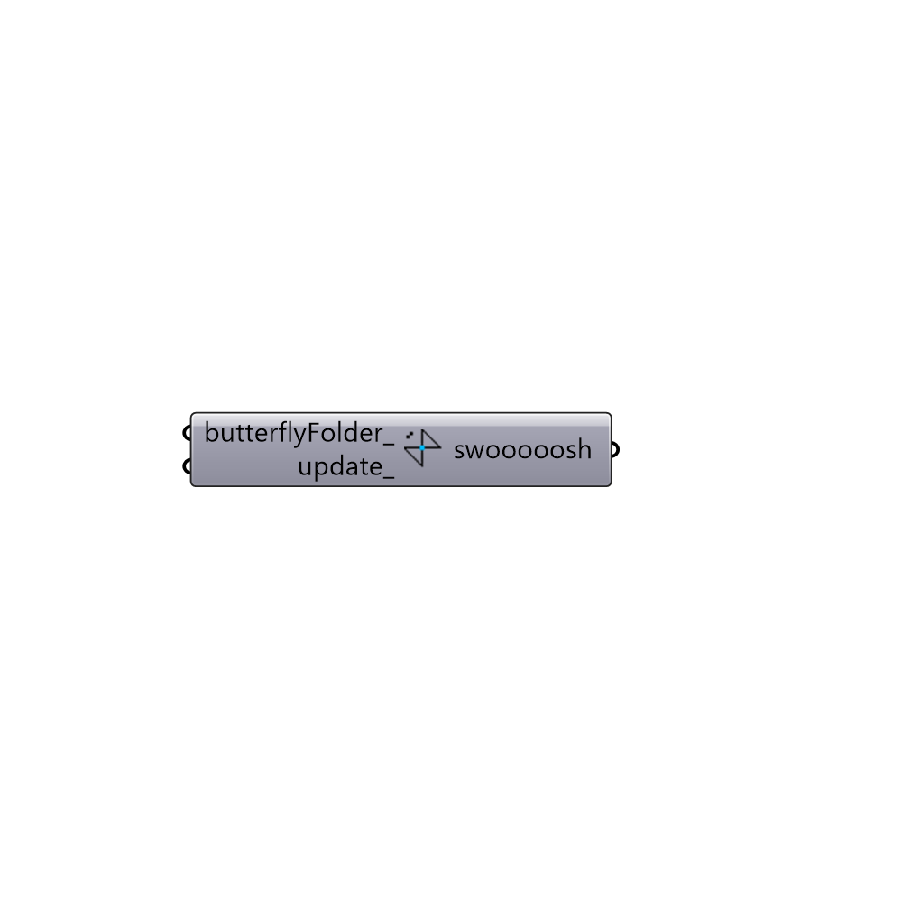

##  Butterfly

This component downloads butterfly library from github to:
 C:\Users\%USERNAME%\AppData\Roaming\McNeel\Rhinoceros\5.0\scripts\butterfly
 -

#### Inputs
* ##### butterflyFolder [Optional]
Optional path to load butterfly libraries instead of the
 installed version
* ##### update [Optional]
Optional boolean to update butterfly even if you have it already installed.

#### Outputs
* ##### swooooosh
!!!

[Check Hydra Example Files for Butterfly](https://hydrashare.github.io/hydra/index.html?keywords=Butterfly)