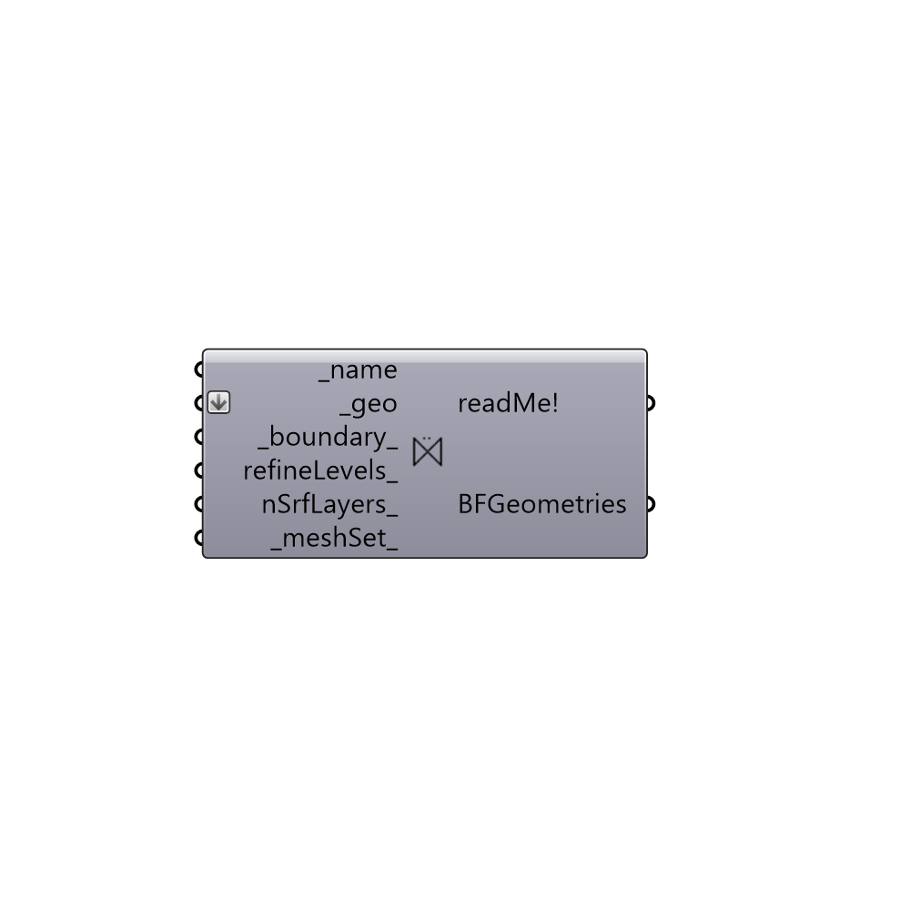

##  Create Butterfly Geometry

Create Butterfly surface.
 -

#### Inputs
* ##### name [Required]
Geometry name.
* ##### geo [Required]
Grasshopper geometries.
* ##### boundary [Default]
Boundary for this surface (e.g. Inlet, Outlet, Wall)
* ##### refineLevels [Optional]
Geometry refinement level as a tuple of two intger (min, max).
* ##### nSrfLayers [Optional]
Number of layers for snappyHexMesh.
* ##### meshSet [Default]
Grasshopper mesh settings.

#### Outputs
* ##### readMe!
Reports, errors, warnings, etc.
* ##### BFGeometries
A Buttefly geometry.

[Check Hydra Example Files for Create Butterfly Geometry](https://hydrashare.github.io/hydra/index.html?keywords=Butterfly_Create Butterfly Geometry)