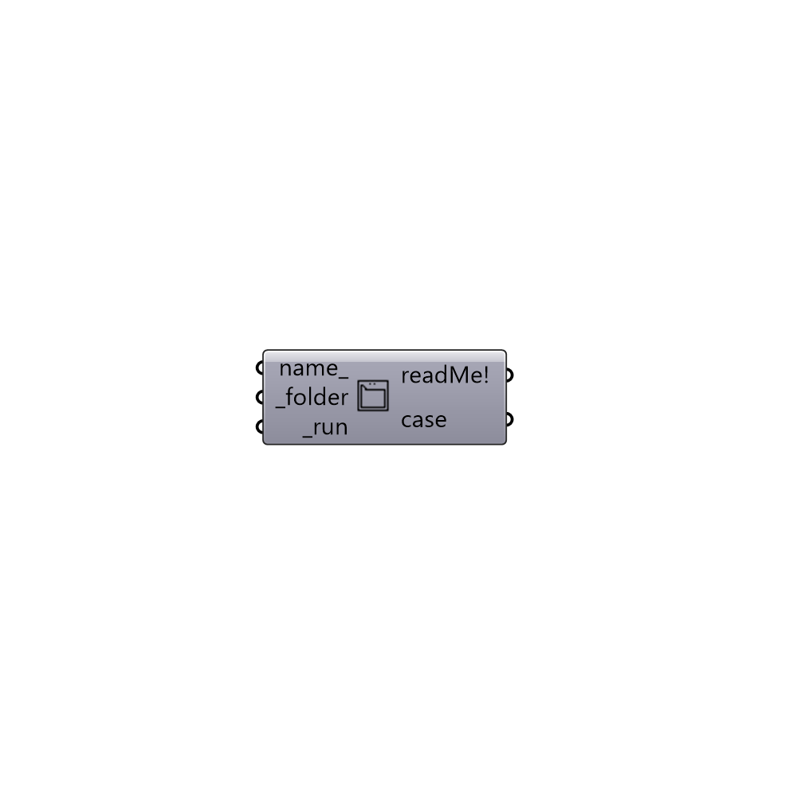

##  Create Case from Folder

Create an OpenFOAM Case from an existing case in a local folder.
 -

#### Inputs
* ##### name [Optional]
Optional new name to change the name of the case.
* ##### folder [Required]
Fullpath to an OpenFoam case folder.
* ##### run [Required]
Create case from inputs.

#### Outputs
* ##### readMe!
Reports, errors, warnings, etc.
* ##### case
Butterfly case.

[Check Hydra Example Files for Create Case from Folder](https://hydrashare.github.io/hydra/index.html?keywords=Butterfly_Create Case from Folder)