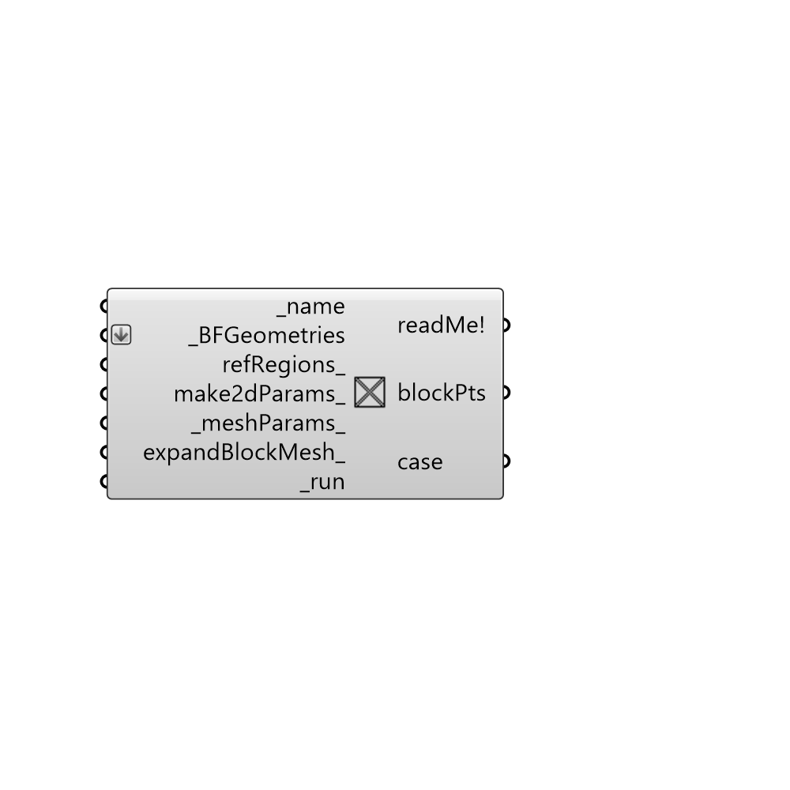

##  Create Case from Geometries

Create an OpenFOAM Case from geometries.
 -

#### Inputs
* ##### name [Required]
Project name.
* ##### BFGeometries [Required]
List of butterfly geometries for this case.
* ##### refRegions [Optional]
A list of refinement regions.
* ##### make2dParams [Optional]
Butterfly parameters to make a 2d wind tunnel.
* ##### meshParams [Default]
Butterfly meshing parameters. You can set-up meshing parameters
 also on the blockMesh and snappyHexMesh components to overwrite this
 settings. Use this input to set up the meshing parameters if you are
 not running the meshing locally.
* ##### expandBlockMesh [Optional]
Butterfly by default expands the mesh by one cell to
 ensure snappyHexMesh will snap to extrior surfaces. You can set the
 expand to off or overwrite the vertices using update blockMeshDict
 component.
* ##### run [Required]
Create case from inputs.

#### Outputs
* ##### readMe!
Reports, errors, warnings, etc.
* ##### blockPts
Script variable caseFromGeos
* ##### case
Butterfly case.

[Check Hydra Example Files for Create Case from Geometries](https://hydrashare.github.io/hydra/index.html?keywords=Butterfly_Create Case from Geometries)