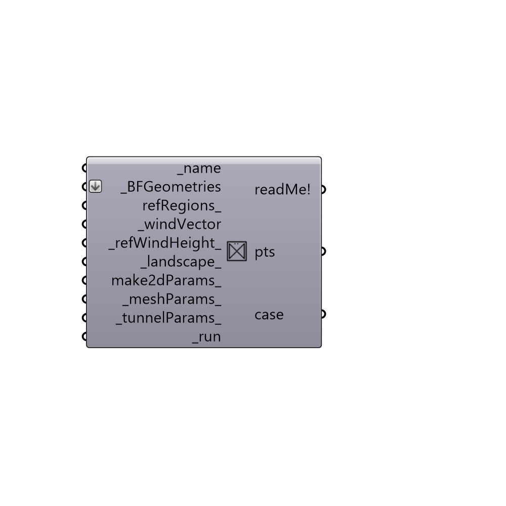

##  Create Case from Tunnel

Create Case from wind tunnel.
 -

#### Inputs
* ##### name [Required]
Project name.
* ##### BFGeometries [Required]
List of butterfly geometries that will be inside the tunnel.
* ##### refRegions [Optional]
Script variable createCaseFromTunnel
* ##### windVector [Required]
A vector that indicates speed and direction of wind. Length
 of the vector will be used as windspeed and the unfied vector will be
 used for wind direction. For wind tunnel vector will be projected to
 XY plane.
* ##### refWindHeight [Default]
Reference height for wind velocity (default: 10m).
* ##### landscape [Default]
An integer between 0-7 to calculate z0 (roughness).
 You can find full description of the landscape in Table I at this
 link (onlinelibrary.wiley.com/doi/10.1002/met.273/pdf)
 0 > '0.0002'  # sea. Open sea or lake (irrespective of wave size),
 tidal flat, snow-covered flat plain, featureless desert, tarmac and
 concrete, with a free fetch of several kilometres
 1 > '0.005'   # smooth. Featureless land surface without any noticeable
 obstacles and with negligible vegetation; e.g. beaches, pack ice without
 large ridges, marsh and snow-covered or fallow open country.
 2 > '0.03'    # open. Level country with low vegetation (e.g. grass)
 and isolated obstacles with separations of at least 50 obstacle heights;
 e.g. grazing land without wind breaks, heather, moor and tundra,
 runway area of airports. Ice with ridges across-wind.
 3 > '0.10'    # roughly open. Cultivated or natural area with low crops
 or plant covers, or moderately open country with occasional obstacles
 (e.g. low hedges, isolated low buildings or trees) at relative horizontal
 distances of at least 20 obstacle heights
 4 > '0.25'    # rough. Cultivated or natural area with high crops or
 crops of varying height, and scattered obstacles at relative distances
 of 12-15 obstacle heights for porous objects (e.g. shelterbelts) or
 8-12 obstacle heights for low solid objects (e.g. buildings).
 5 > '0.5'     # very rough. Intensively cultivated landscape with many
 rather large obstacle groups (large farms, clumps of forest) separated
 by open spaces of about eight obstacle heights. Low densely planted
 major vegetation like bush land, orchards, young forest. Also, area
 moderately covered by low buildings with interspaces of three to
 seven building heights and no high trees.
 6 > '1.0'     # Skimming. Landscape regularly covered with similar-size
 large obstacles, with open spaces of the same order of magnitude as
 obstacle heights; e.g. mature regular forests, densely built-up area
 without much building height variation.
 7 > '2.0'     # chaotic. City centres with mixture of low-rise and
 high-rise buildings, or large forests of irregular height with many
 clearings.
* ##### make2dParams [Optional]
Butterfly parameters to make a 2d wind tunnel.
* ##### meshParams [Default]
Butterfly meshing parameters. You can set-up meshing parameters
 also on the blockMesh and snappyHexMesh components to overwrite this
 settings. Use this input to set up the meshing parameters if you are
 not running the meshing locally.
* ##### tunnelParams [Default]
Butterfly tunnel parameters.
* ##### run [Required]
Create wind tunnel case from inputs.

#### Outputs
* ##### readMe!
Reports, errors, warnings, etc.
* ##### pts
Wind tunnel corners for visualization.
* ##### case
Butterfly case.

[Check Hydra Example Files for Create Case from Tunnel](https://hydrashare.github.io/hydra/index.html?keywords=Butterfly_Create Case from Tunnel)