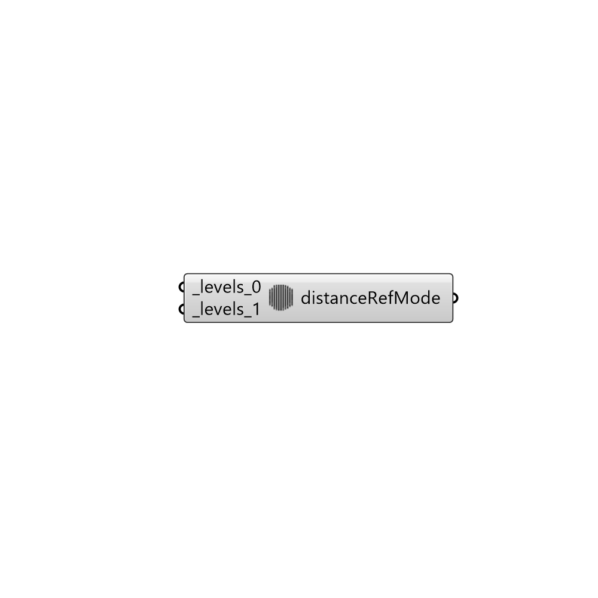

##  DistanceRefinementMode

Inside/Ouside region refinement.
 -

#### Inputs
* ##### levels_0 [Required]
(d, l) values for level where d is distance of region and 
 l is level of refinement. 'levels' specifies per distance to the
 surface the wanted refinement level.
* ##### levels_1 [Required]
Script variable Python

#### Outputs
* ##### distanceRefMode
Refinement mode.

[Check Hydra Example Files for DistanceRefinementMode](https://hydrashare.github.io/hydra/index.html?keywords=Butterfly_DistanceRefinementMode)