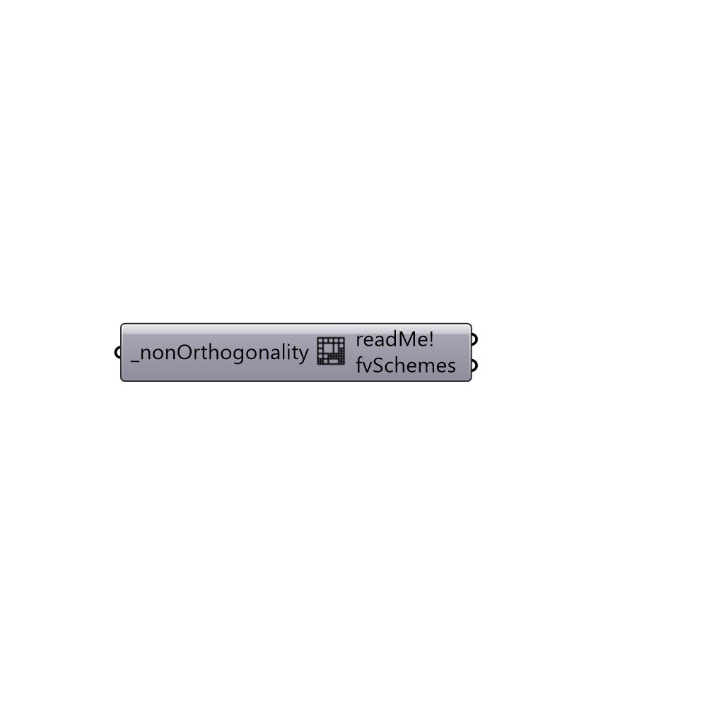

##  FvSchemes from Non-orthogonality

Generate fvSchemes based on mesh non-orthogonalities.
 -

#### Inputs
* ##### nonOrthogonality [Required]
Maximum mesh non-orthogonality as an integer.

#### Outputs
* ##### readMe!
Reports, errors, warnings, etc.
* ##### fvSchemes
Recommended fvSchemes. Use solution parameter to update fvSchemes
 for the solution.

[Check Hydra Example Files for FvSchemes from Non-orthogonality](https://hydrashare.github.io/hydra/index.html?keywords=Butterfly_FvSchemes from Non-orthogonality)