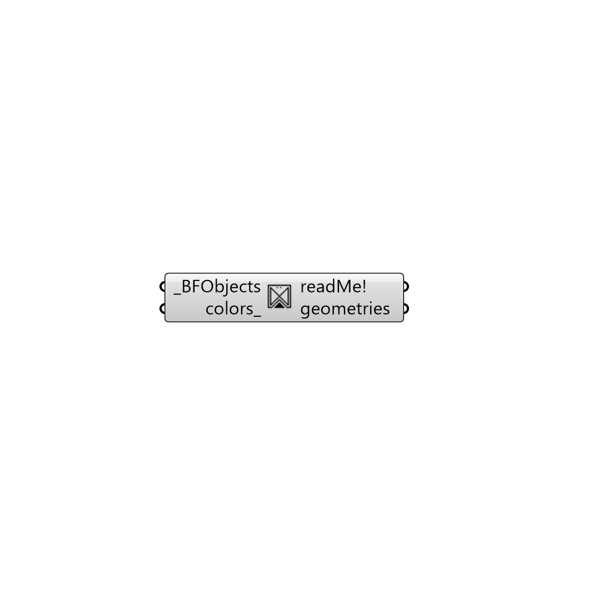

##  Get Geometry

Update fvSchemes values based on mesh orthogonalities.
 -

#### Inputs
* ##### BFObjects [Required]
A list of butterfly objects.
* ##### colors [Optional]
Optional input for colors to 

#### Outputs
* ##### readMe!
Reports, errors, warnings, etc.
* ##### geometries
List of geometries as meshes.

[Check Hydra Example Files for Get Geometry](https://hydrashare.github.io/hydra/index.html?keywords=Butterfly_Get Geometry)