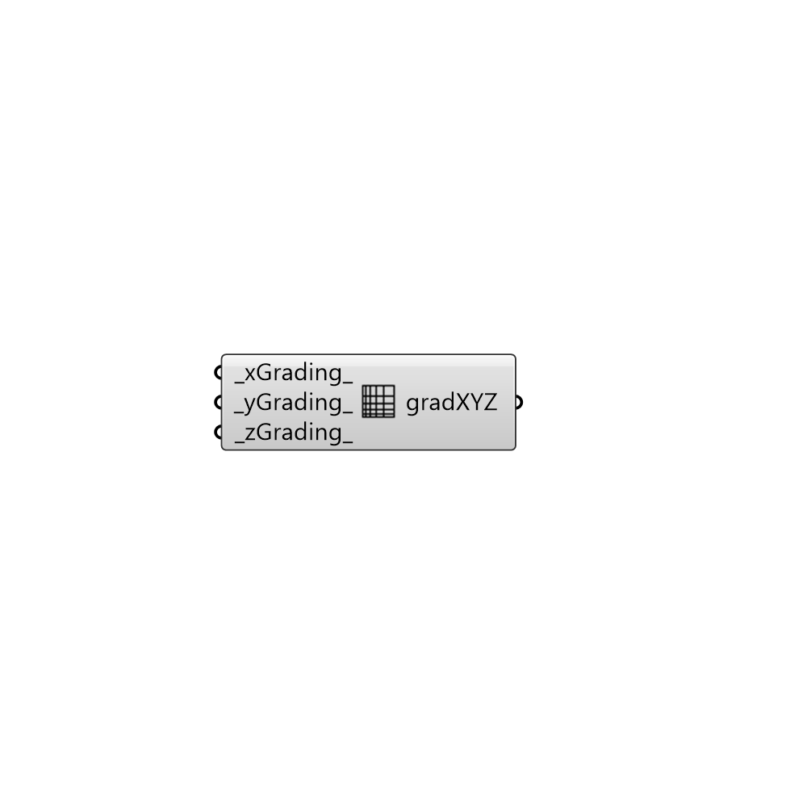

##  Grading XYZ

MultiGrading
 Create a grading for multiple segmentGradings.
 -

#### Inputs
* ##### xGrading [Default]
(d, l) values for level where d is distance of region and 
 l is level of refinement. 'levels' specifies per distance to the
 surface the wanted refinement level.
* ##### yGrading [Default]
Script variable Python
* ##### zGrading [Default]
Script variable distRefMode

#### Outputs
* ##### gradXYZ
Refinement mode.

[Check Hydra Example Files for Grading XYZ](https://hydrashare.github.io/hydra/index.html?keywords=Butterfly_Grading XYZ)