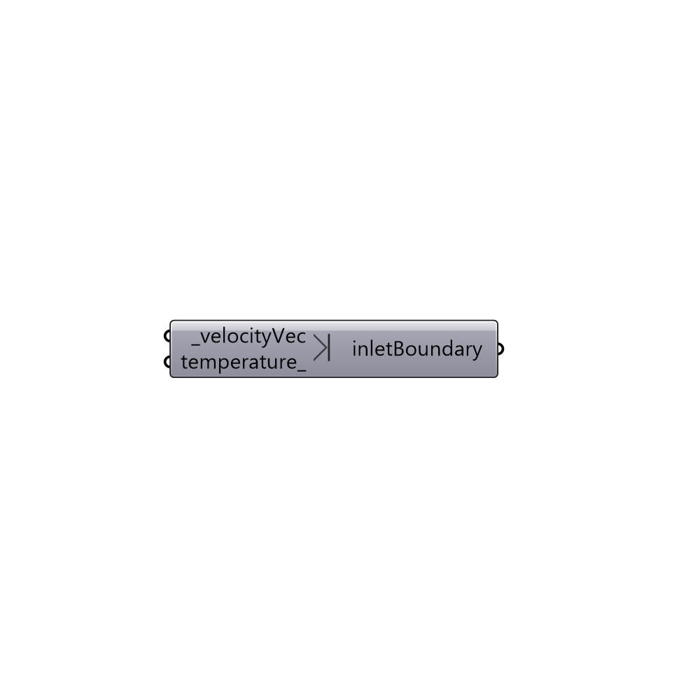

##  Inlet Boundary

Create an inlet boundary with uniform velocity value.
 -

#### Inputs
* ##### velocityVec [Required]
Velocity vector.
* ##### temperature [Optional]
Temperature in degrees celsius.

#### Outputs
* ##### inletBoundary
Buttefly inlet boundary.

[Check Hydra Example Files for Inlet Boundary](https://hydrashare.github.io/hydra/index.html?keywords=Butterfly_Inlet Boundary)