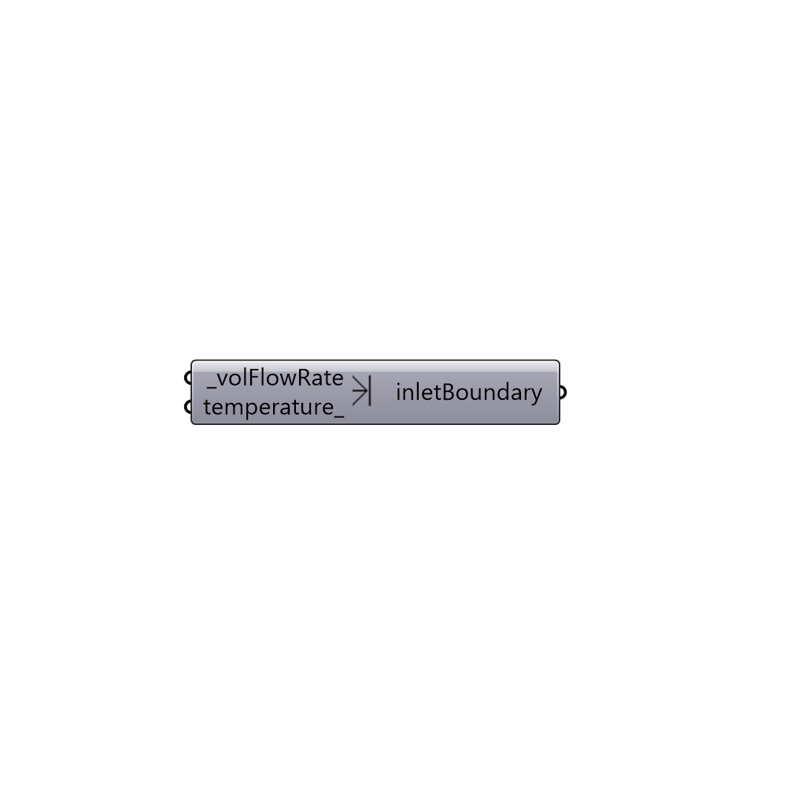

##  Inlet Flow-Rate Boundary

Create an inlet boundary with flow rate in m3/s.
 -

#### Inputs
* ##### volFlowRate [Required]
Volumetric flow rate in m3/s.
* ##### temperature [Optional]
Temperature in degrees celsius.

#### Outputs
* ##### inletBoundary
Buttefly inlet boundary.

[Check Hydra Example Files for Inlet Flow-Rate Boundary](https://hydrashare.github.io/hydra/index.html?keywords=Butterfly_Inlet Flow-Rate Boundary)