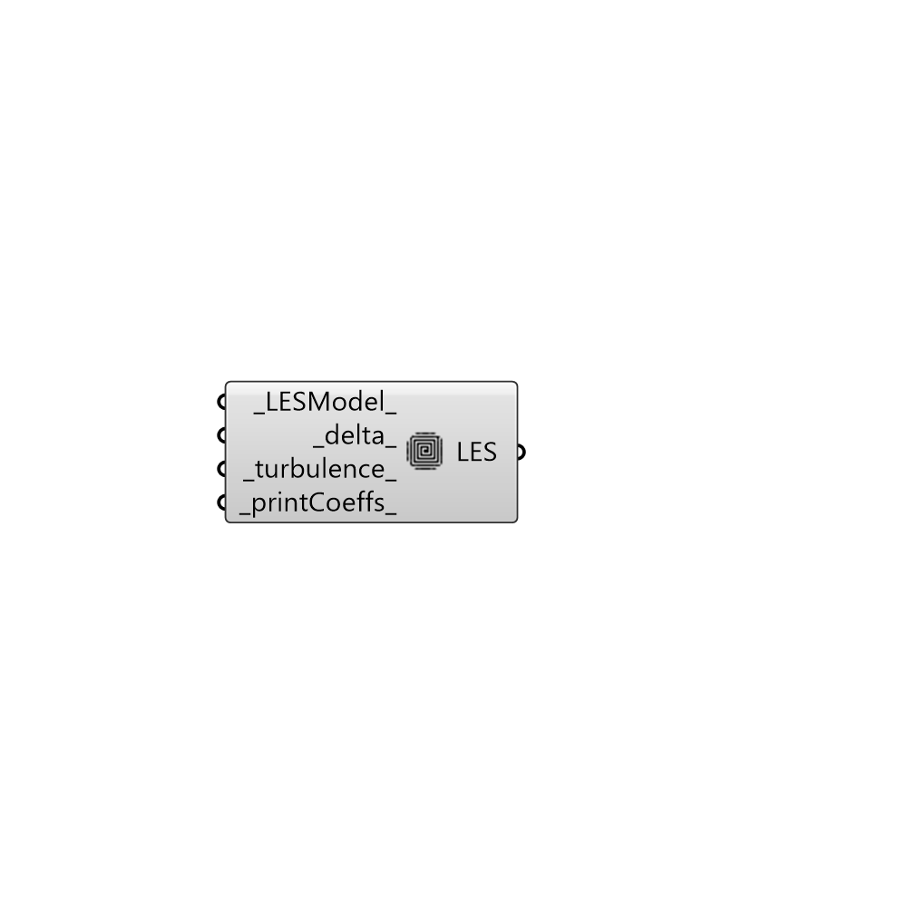

##  LES Turbulance Model

Large eddy simulation (LES) modelling.
 Read more: http://cfd.direct/openfoam/user-guide/turbulence/
 Watch this: https://www.youtube.com/watch?v=Eu_4ppppQmw

#### Inputs
* ##### LESModel [Default]
Name of LES turbulence model.
 Incompressible LES turbulence models.
 DeardorffDiffStress, Smagorinsky, SpalartAllmarasDDES,
 SpalartAllmarasDES, SpalartAllmarasIDDES, WALE, dynamicKEqn,
 dynamicLagrangian, kEqn, kOmegaSSTDES
 Compressible LES turbulence models.
 DeardorffDiffStress, Smagorinsky, SpalartAllmarasDDES,
 SpalartAllmarasDES, SpalartAllmarasIDDES, WALE, dynamicKEqn,
 dynamicLagrangian, kEqn, kOmegaSSTDES
* ##### delta [Default]
Name of delta model.
* ##### turbulence [Default]
Boolean switch to turn the solving of turbulence
 modelling on/off (default: True).
* ##### printCoeffs [Default]
Boolean switch to print model coeffs to terminal at
 simulation start up (default: True).

#### Outputs
* ##### LES
Script variable Python

[Check Hydra Example Files for LES Turbulance Model](https://hydrashare.github.io/hydra/index.html?keywords=Butterfly_LES Turbulance Model)