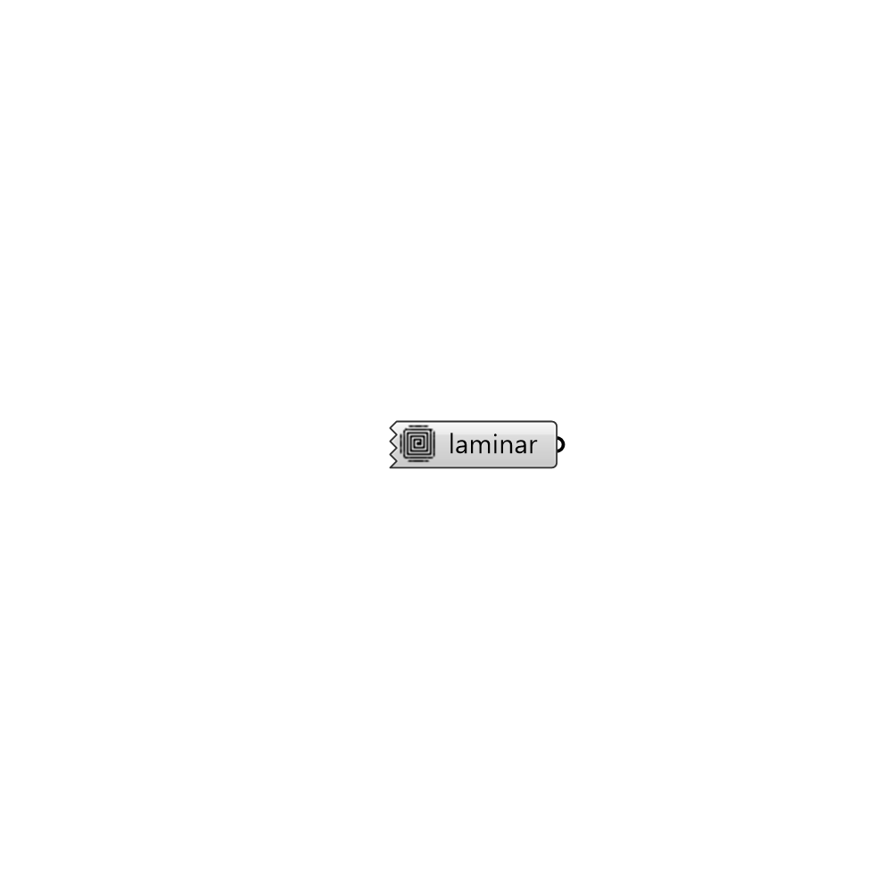

##  Laminar Turbulance Model

Large eddy simulation (LES) modelling.
 Read more: http://cfd.direct/openfoam/user-guide/turbulence/
 Watch this: https://www.youtube.com/watch?v=Eu_4ppppQmw

#### Inputs

#### Outputs
* ##### laminar
Laminar model

[Check Hydra Example Files for Laminar Turbulance Model](https://hydrashare.github.io/hydra/index.html?keywords=Butterfly_Laminar Turbulance Model)