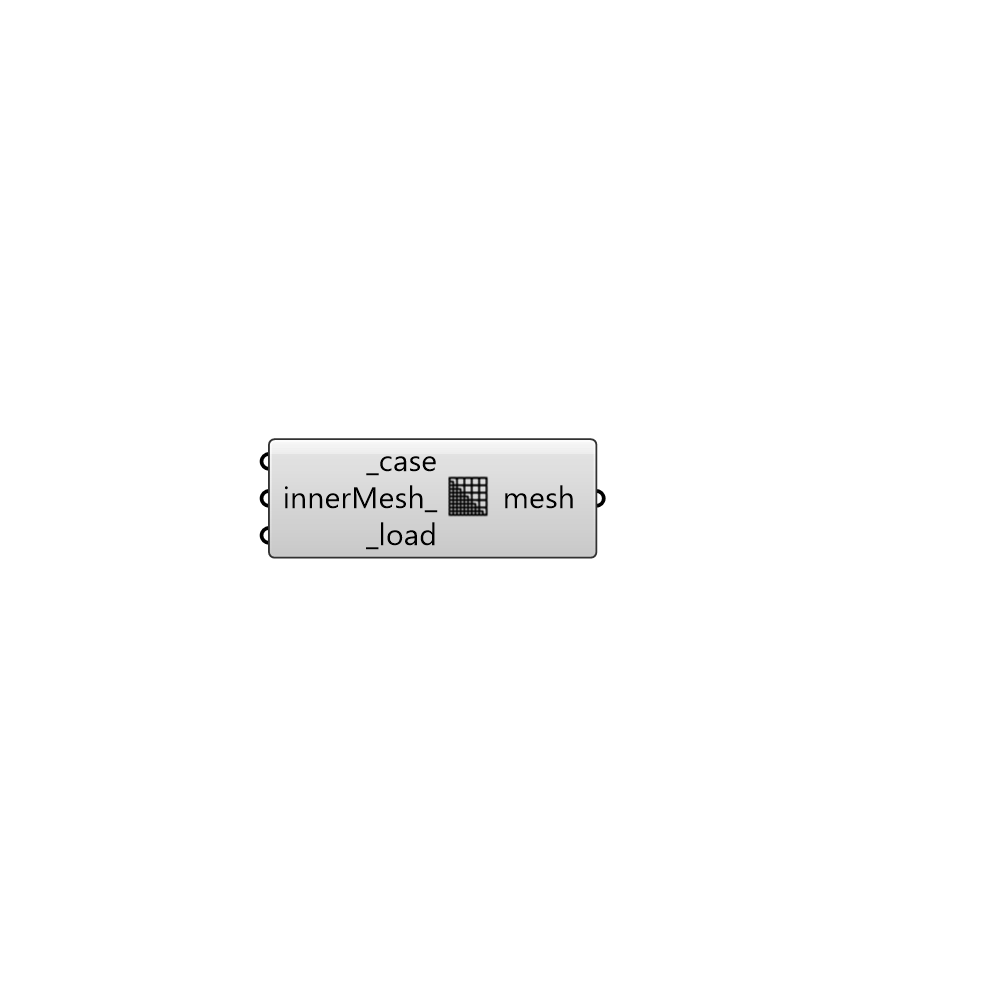

##  Load Mesh

Load mesh from the case for preview.
 -

#### Inputs
* ##### case [Required]
Butterfly case.
* ##### innerMesh [Optional]
Set to True to load inner mesh. Default is False which means
 the component only loads the mesh for boundary faces.
* ##### load [Required]
Load mesh.

#### Outputs
* ##### mesh
OpenFOAM mesh

[Check Hydra Example Files for Load Mesh](https://hydrashare.github.io/hydra/index.html?keywords=Butterfly_Load Mesh)