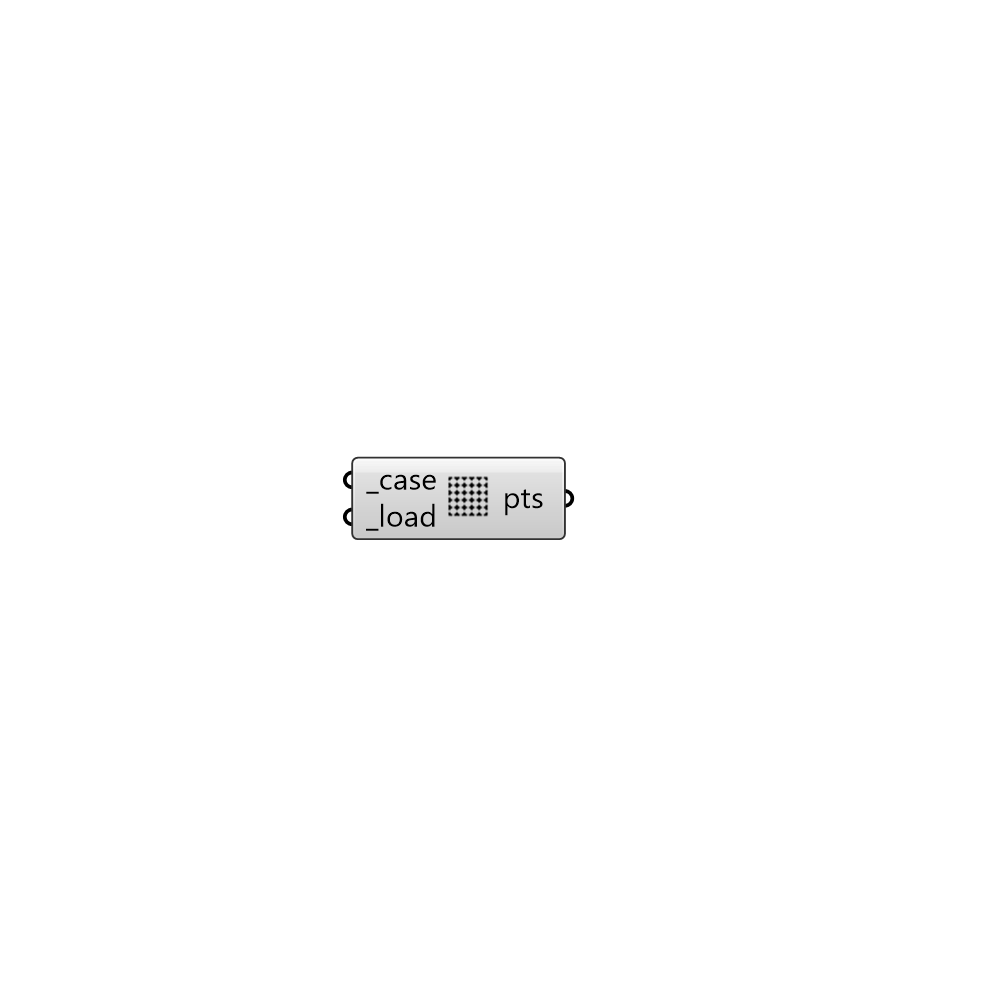

##  Load Points

Load points from the case for preview.
 -

#### Inputs
* ##### case [Required]
Butterfly case.
* ##### load [Required]
Load points.

#### Outputs
* ##### pts
Script output pts.

[Check Hydra Example Files for Load Points](https://hydrashare.github.io/hydra/index.html?keywords=Butterfly_Load Points)