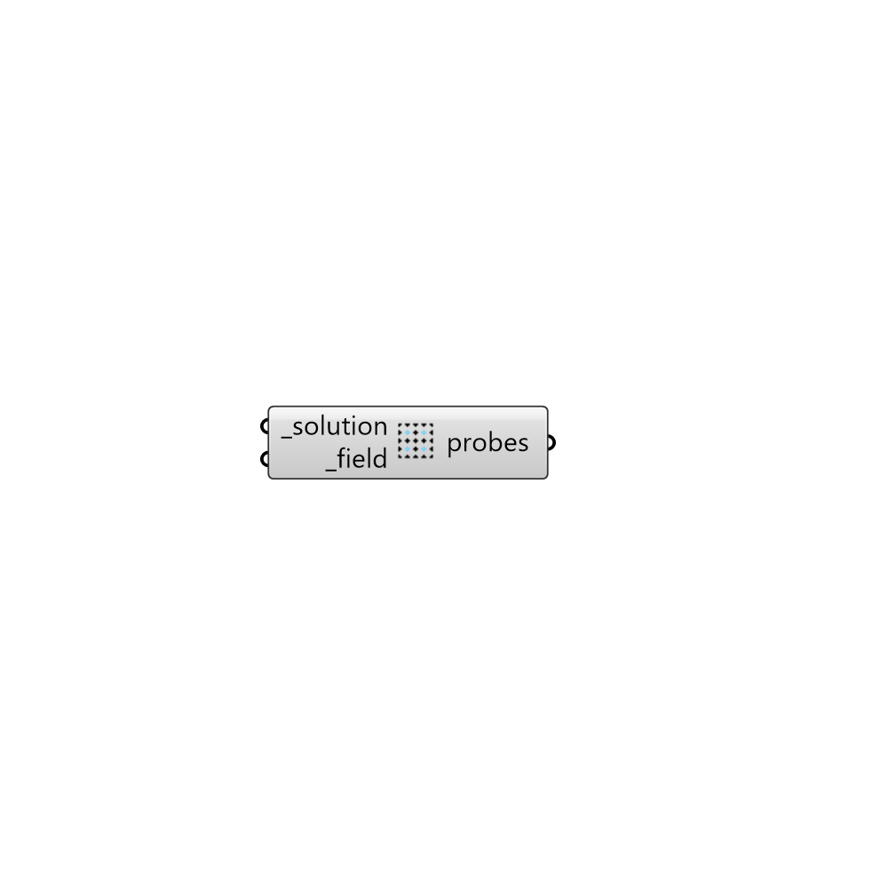

##  Load Probes

Load probes from a folder.
 -

#### Inputs
* ##### solution [Required]
Butterfly Solution, Case or fullpath to the case folder.
* ##### field [Required]
Probes' filed as a string (e.g. p, U).

#### Outputs
* ##### probes
List of probes as points.

[Check Hydra Example Files for Load Probes](https://hydrashare.github.io/hydra/index.html?keywords=Butterfly_Load Probes)