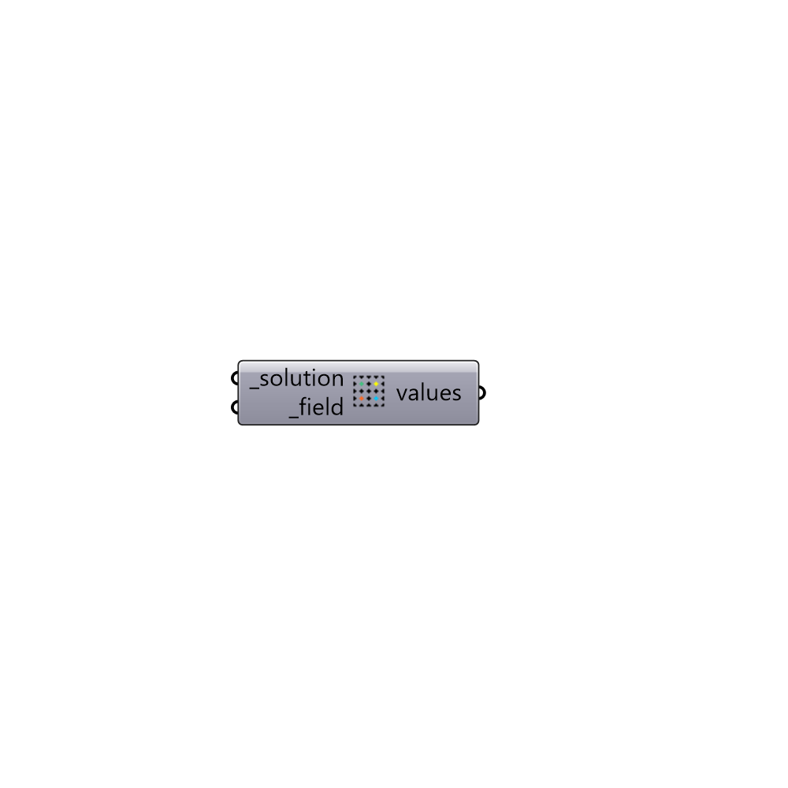

##  Load Probes Value

Load results for a field in probes.
 -

#### Inputs
* ##### solution [Required]
Butterfly Solution, Case or fullpath to the case folder.
* ##### field [Required]
Probes' filed as a string (e.g. p, U).

#### Outputs
* ##### values
List of values for the last timestep.

[Check Hydra Example Files for Load Probes Value](https://hydrashare.github.io/hydra/index.html?keywords=Butterfly_Load Probes Value)