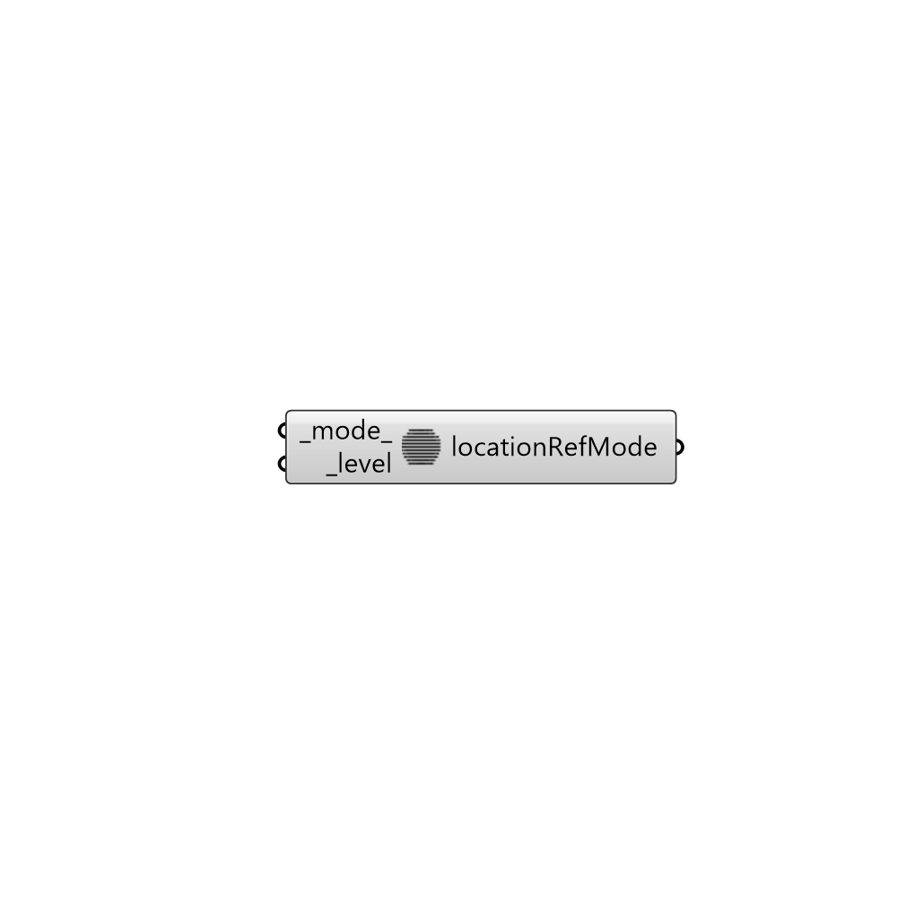

##  LocationRefinementMode

Inside/Ouside region refinement.
 -

#### Inputs
* ##### mode [Default]
Refinement mode (0: inside, 1: outside).
* ##### level [Required]
Refinement level as an integer. All cells inside the surface get
 refined up to the level. The surface needs to be closed for this to
 be possible.

#### Outputs
* ##### locationRefMode
Refinement mode.

[Check Hydra Example Files for LocationRefinementMode](https://hydrashare.github.io/hydra/index.html?keywords=Butterfly_LocationRefinementMode)