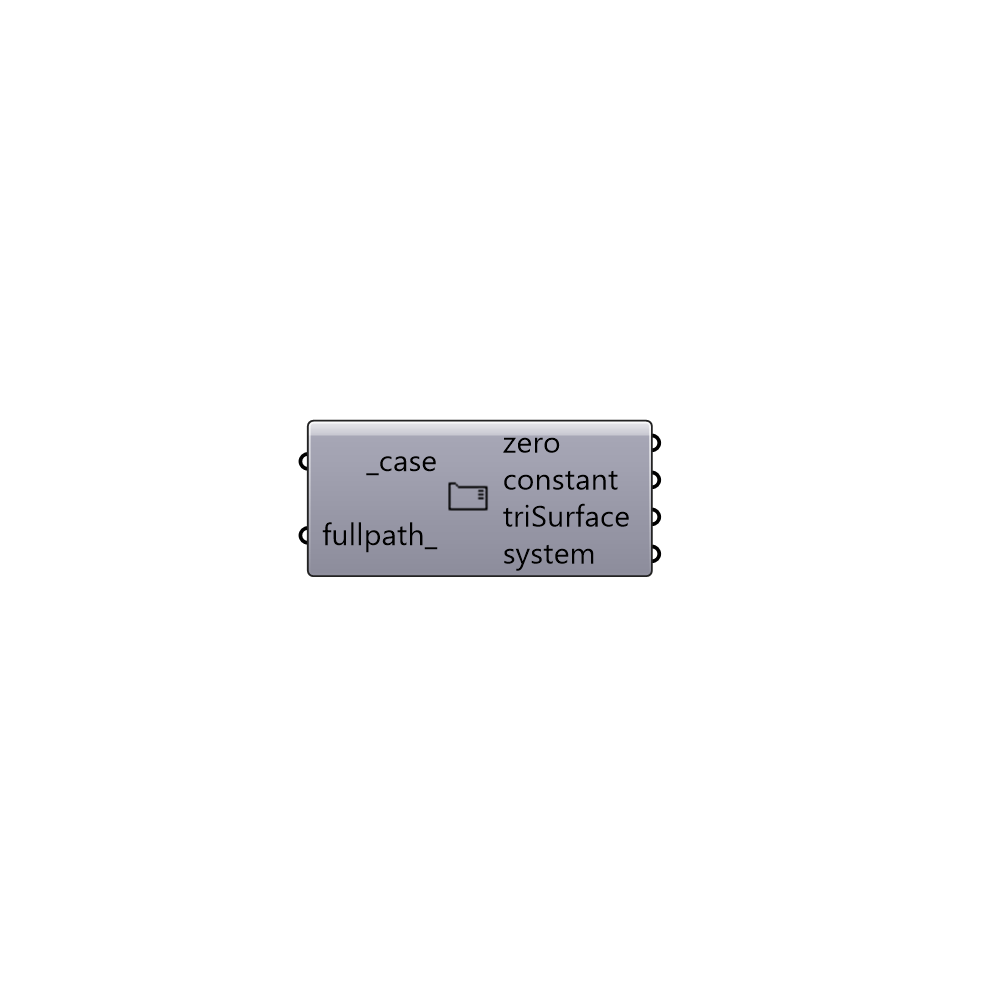

##  Look Up Case Folder

Look Up Case Folder.
 -

#### Inputs
* ##### case [Required]
Butterfly case.
* ##### fullpath [Optional]
Set to True to get fullpath for the files.

#### Outputs
* ##### zero
Files in zero folder.
* ##### constant
Files in constant folder.
* ##### triSurface
Files in constant/triSurface folder.
* ##### system
Files in system folder.

[Check Hydra Example Files for Look Up Case Folder](https://hydrashare.github.io/hydra/index.html?keywords=Butterfly_Look Up Case Folder)