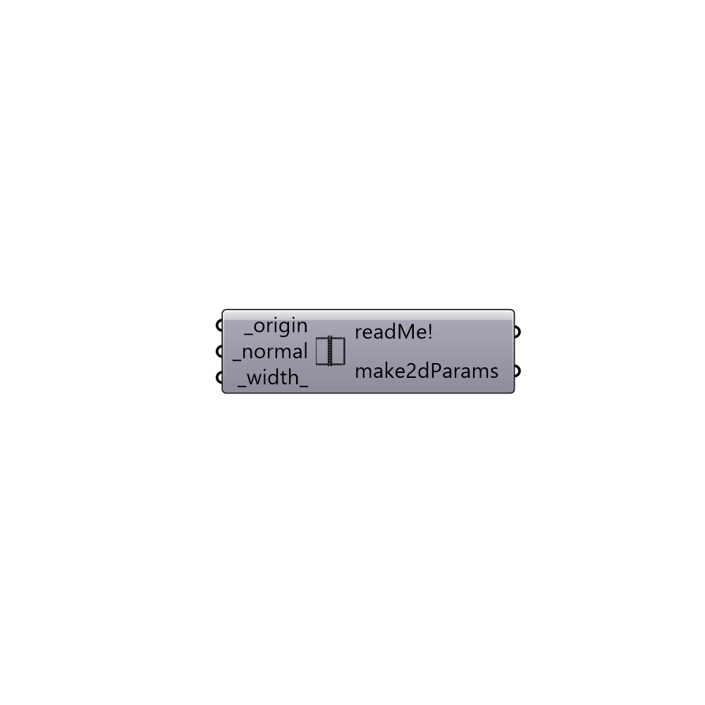

##  Make2d Parameters

Make a case 2d.

#### Inputs
* ##### origin [Required]
Origin point for the 2d case cutting plane.
* ##### normal [Required]
Normal direction for the cutting plane as a vector.
* ##### width [Default]
Width of 2d case (default: 0.5)

#### Outputs
* ##### readMe!
The execution information, as output and error streams
* ##### make2dParams
Parameters for creating a 2d case.

[Check Hydra Example Files for Make2d Parameters](https://hydrashare.github.io/hydra/index.html?keywords=Butterfly_Make2d Parameters)