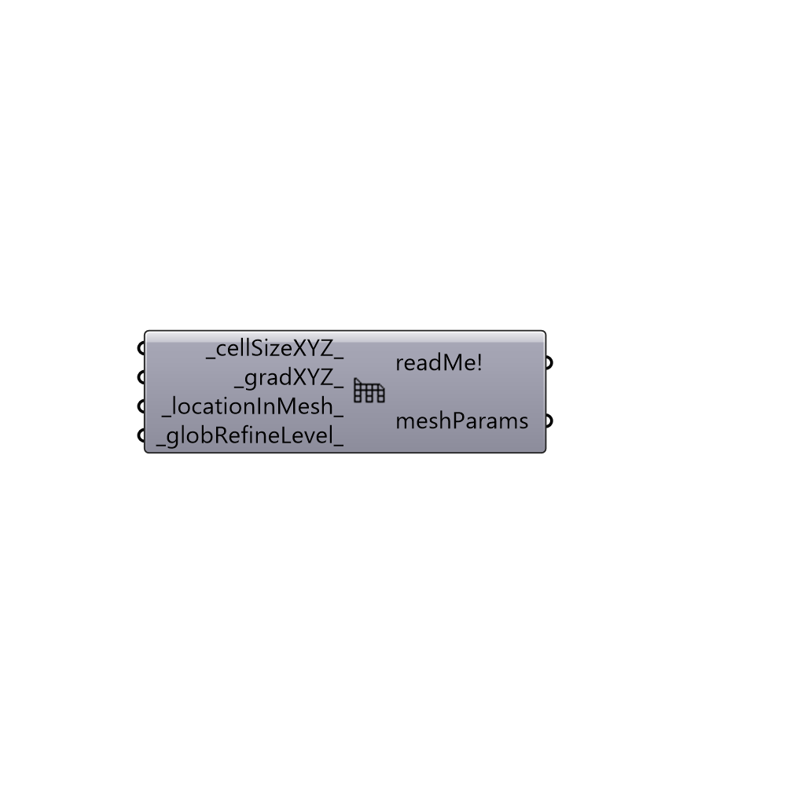

##  Meshing Parameters

Set meshing parameters for blockMesh and snappyHexMesh.

#### Inputs
* ##### cellSizeXYZ [Default]
Cell size in (x, y, z) as a tuple (default: length / 5).
 This value updates number of divisions in blockMeshDict.
* ##### gradXYZ [Default]
A simpleGrading (default: simpleGrading(1, 1, 1)). This value
 updates grading in blockMeshDict.
* ##### locationInMesh [Default]
A tuple for the location of the mesh to be kept. This
 value updates locationInMesh in snappyHexMeshDict.
* ##### globRefineLevel [Default]
A tuple of (min, max) values for global refinment.
 This value updates globalRefinementLevel in snappyHexMeshDict.

#### Outputs
* ##### readMe!
The execution information, as output and error streams
* ##### meshParams
meshingParameters.

[Check Hydra Example Files for Meshing Parameters](https://hydrashare.github.io/hydra/index.html?keywords=Butterfly_Meshing Parameters)