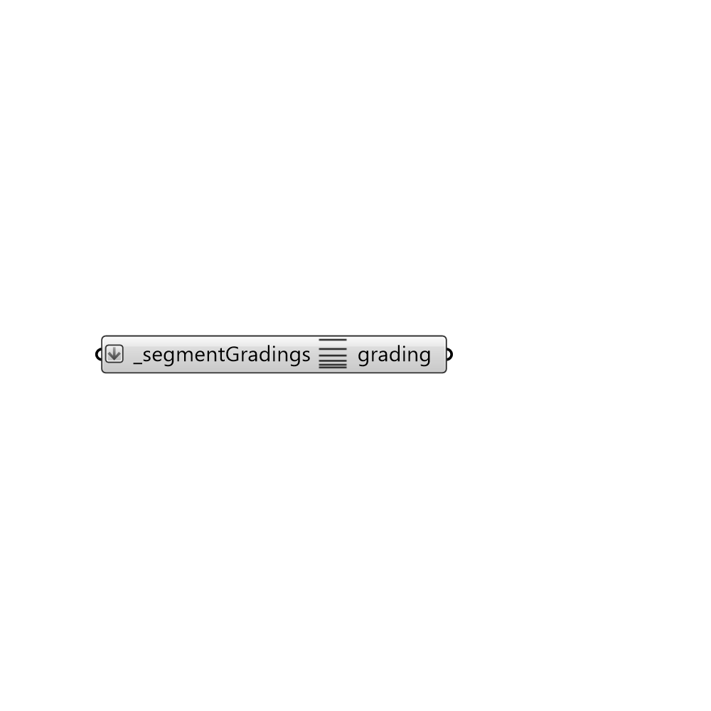

##  MultiGrading

MultiGrading
 Create a grading for multiple segmentGradings.
 -

#### Inputs
* ##### segmentGradings [Required]
A list of segmentGradings.

#### Outputs
* ##### grading
A butterfly Grading. Connect the output to gradXYZ component to
 set the grading of blockMesh in X, Y or Z direction.

[Check Hydra Example Files for MultiGrading](https://hydrashare.github.io/hydra/index.html?keywords=Butterfly_MultiGrading)