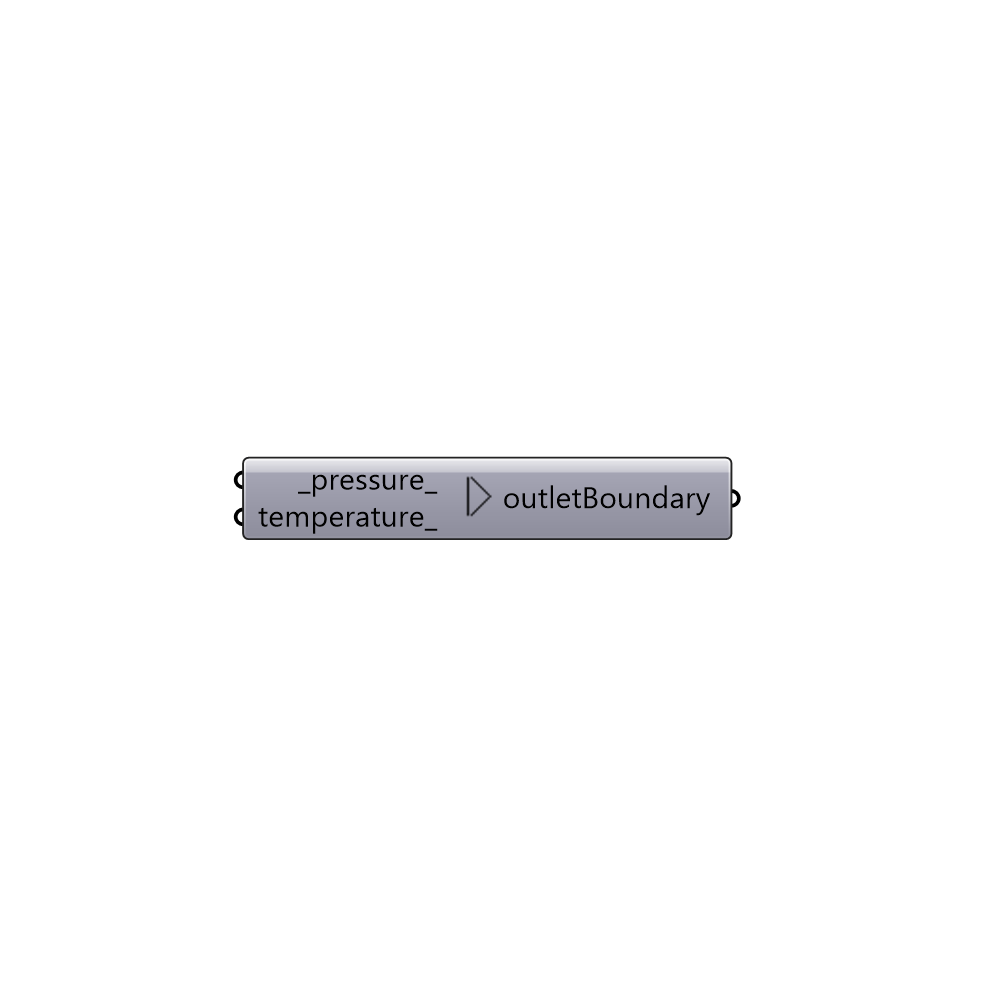

##  Outlet Boundary

Create an outlet boundary with uniform pressure value.
 -

#### Inputs
* ##### pressure [Default]
Pressure as a float (default: 0).
* ##### temperature [Optional]
Temperature in degrees celsius.

#### Outputs
* ##### outletBoundary
Buttefly outlet boundary.

[Check Hydra Example Files for Outlet Boundary](https://hydrashare.github.io/hydra/index.html?keywords=Butterfly_Outlet Boundary)