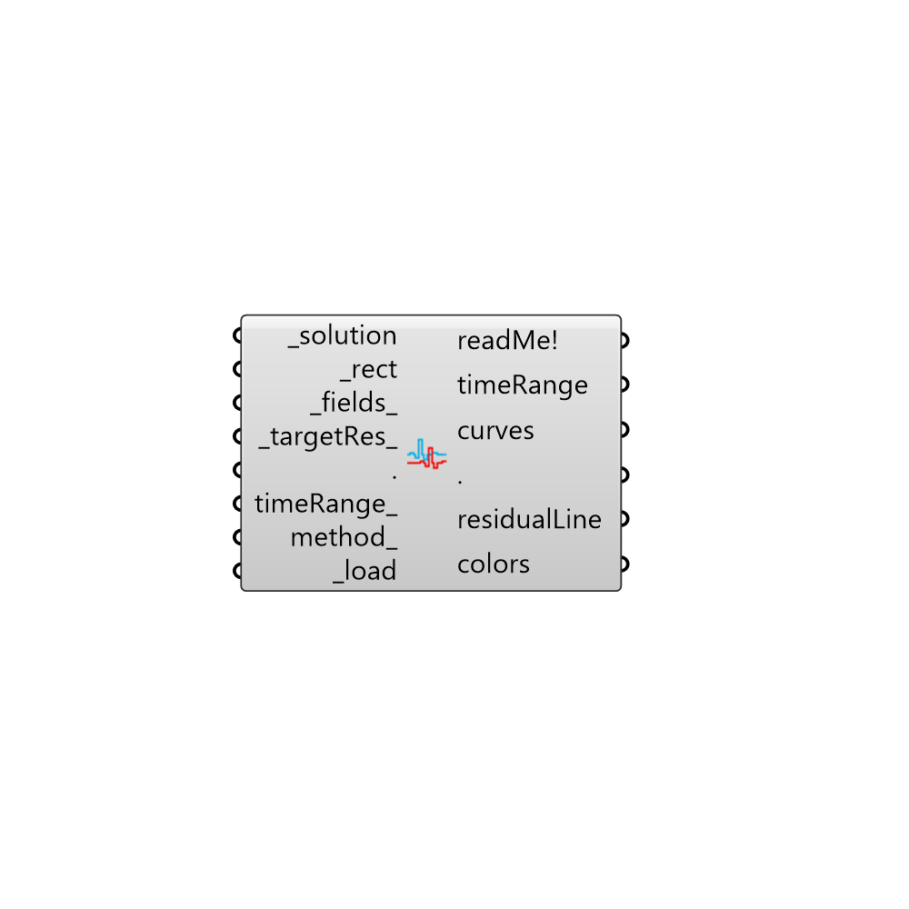

##  Plot Residuals

Load residual values for a case.
 -

#### Inputs
* ##### solution [Required]
A Butterfly recipe.
* ##### rect [Required]
A rectangle for boundary chart.
* ##### fields [Default]
Residual fields. If empty solution's fields will be used.
* ##### targetRes [Default]
Residential number that will be added to the graph as a black line.
* ##### timeRange [Optional]
timeRange for loading residuals as a domain.
* ##### method [Optional]
Method of ploting the values (0..1). 0: Curves, 1: Colored mesh
 If you're updating the values frequently use method 1 which is the
 quicker method.
* ##### load [Required]
Script variable loadResiduals

#### Outputs
* ##### readMe!
Reports, erros, warnings, etc.
* ##### timeRange
Total time range.
* ##### curves
Lines as curves.
* ##### residualLine
Residual line.
* ##### colors
List of colors for meshes to color text, etc.

[Check Hydra Example Files for Plot Residuals](https://hydrashare.github.io/hydra/index.html?keywords=Butterfly_Plot Residuals)