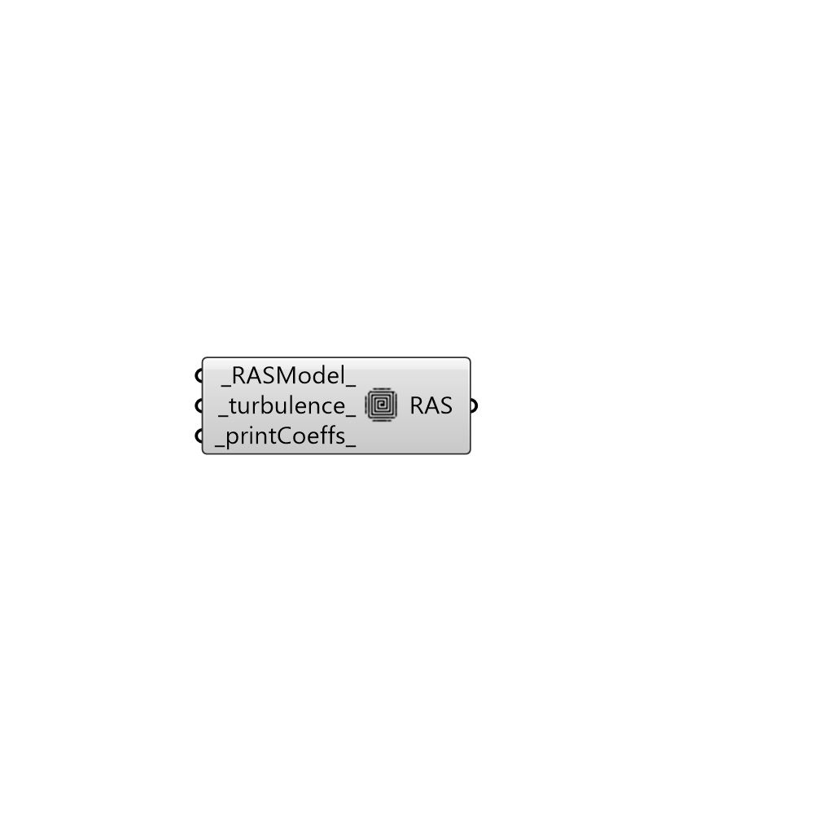

##  RAS Turbulance Model

Reynolds-averaged simulation (RAS) turbulence model.
 Read more: http://cfd.direct/openfoam/user-guide/turbulence/
 Watch this: https://www.youtube.com/watch?v=Eu_4ppppQmw

#### Inputs
* ##### RASModel [Default]
Name of RAS turbulence model (default: RNGkEpsilon).
 Incompressible RAS turbulence models.
 LRR, LamBremhorstKE, LaunderSharmaKE, LienCubicKE,
 LienLeschziner, RNGkEpsilon, SSG, ShihQuadraticKE,
 SpalartAllmaras, kEpsilon, kOmega, kOmegaSSTSAS, kkLOmega,
 qZeta, realizableKE, v2f
 Compressible RAS turbulence models.
 LRR, LaunderSharmaKE, RNGkEpsilon, SSG, SpalartAllmaras,
 buoyantKEpsilon, kEpsilon, kOmega, kOmegaSSTSAS,
 realizableKE, v2f
* ##### turbulence [Default]
Boolean switch to turn the solving of turbulence
 modelling on/off (default: True).
* ##### printCoeffs [Default]
Boolean switch to print model coeffs to terminal at
 simulation start up (default: True).

#### Outputs
* ##### RAS
Script variable Python

[Check Hydra Example Files for RAS Turbulance Model](https://hydrashare.github.io/hydra/index.html?keywords=Butterfly_RAS Turbulance Model)