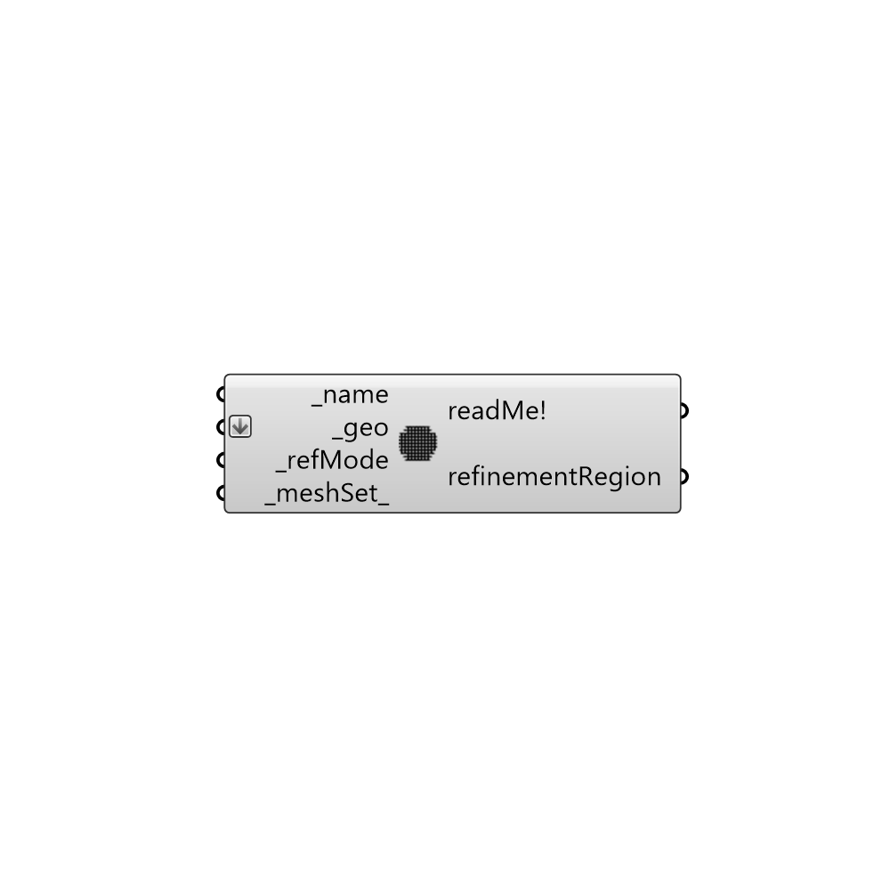

##  Refinement Region

Butterfly refinement range.
 -

#### Inputs
* ##### name [Required]
Surface name.
* ##### geo [Required]
Grasshopper geometries.
* ##### refMode [Required]
Refinement mode. Used locationRefMode or distanceRefMode components.
* ##### meshSet [Default]
Grasshopper mesh settings.

#### Outputs
* ##### readMe!
Reports, errors, warnings, etc.
* ##### refinementRegion
A Buttefly refinement region.

[Check Hydra Example Files for Refinement Region](https://hydrashare.github.io/hydra/index.html?keywords=Butterfly_Refinement Region)