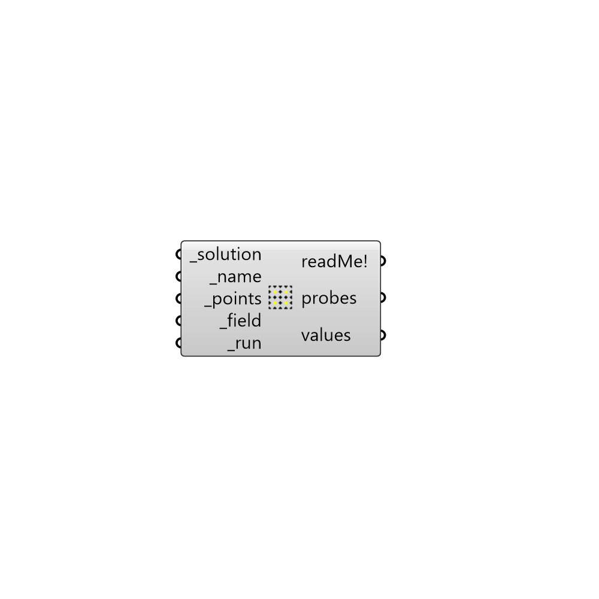

##  Sample Case

Sample the results for a case.
 Use this component yo load the results for a case that you have ran already. 
 -

#### Inputs
* ##### solution [Required]
Butterfly Solution, Case or fullpath to the case folder.
* ##### name [Required]
A name for this smaple. The results will be saved under postProcessing
 folder under <name>_<field>_sampleDict/<latestTime>/<name>_<field>.xy
* ##### points [Required]
A list of flattened points to be sampled.
* ##### field [Required]
Filed of interest as a string (e.g. p, U).
* ##### run [Required]
Set to true to run the sample.

#### Outputs
* ##### readMe!
The execution information, as output and error streams
* ##### probes
List of probes as points. This list should be identical to the input
 _points if there is no skipped points.
* ##### values
List of values as numbers or vectors.

[Check Hydra Example Files for Sample Case](https://hydrashare.github.io/hydra/index.html?keywords=Butterfly_Sample Case)