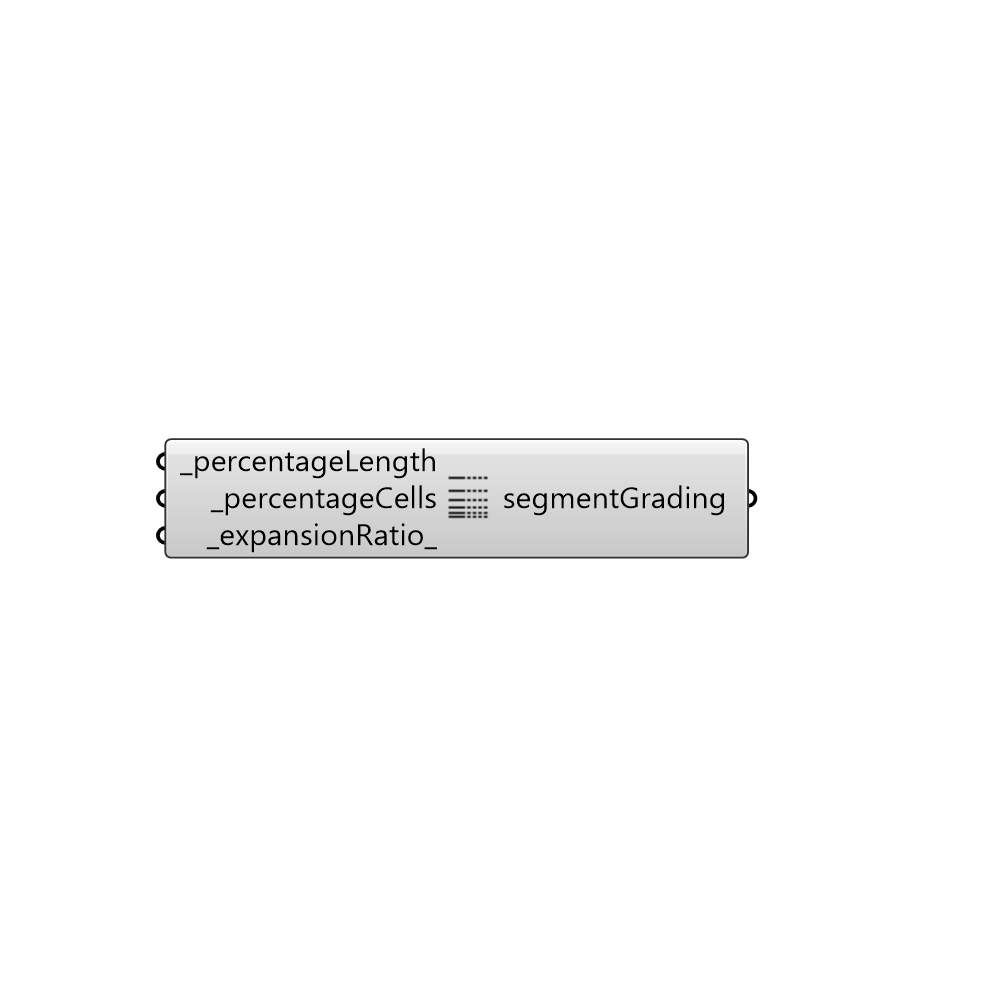

##  Segment Grading

Segment Grading.
 Use this component to create a grading for a segment of the block based on ratio
 or length.
 -

#### Inputs
* ##### percentageLength [Required]
Percentage of length of the block.
* ##### percentageCells [Required]
Percentage of cells to be included in this segment.
* ##### expansionRatio [Default]
Expansion ration in this segment (default: 1).

#### Outputs
* ##### segmentGrading
A segment grading. Use MultiGrading component to create
 a grading.

[Check Hydra Example Files for Segment Grading](https://hydrashare.github.io/hydra/index.html?keywords=Butterfly_Segment Grading)