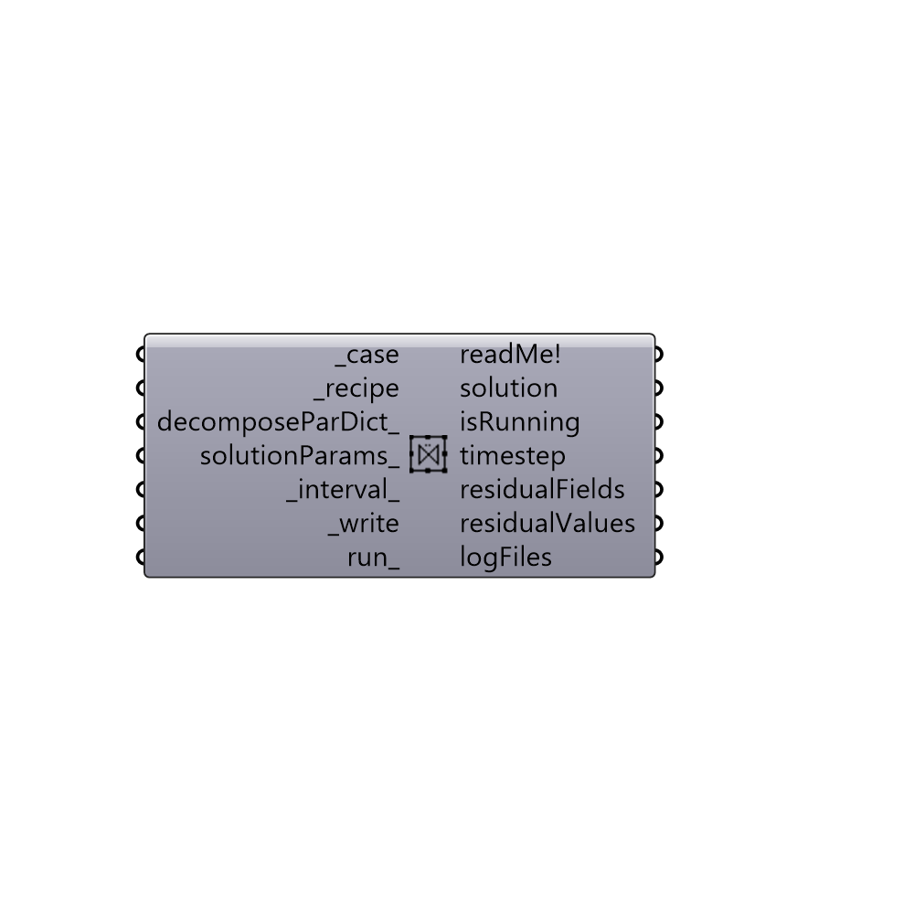

##  Solution

Run recipes using OpenFOAM.
 -

#### Inputs
* ##### case [Required]
A Butterfly case.
* ##### recipe [Required]
A Butterfly recipe.
* ##### decomposeParDict [Optional]
decomposeParDict for parallel run. By default solution
 runs in serial.
* ##### solutionParams [Optional]
Butterfly solutionParams. These parameters can be edited
 while the analysis is running. Ensure to use valid values. Butterfly
 does not check the input values for accuracy.
* ##### interval [Default]
Time interval for updating solution in Grasshopper in seconds.
* ##### write [Required]
Script input _write.
* ##### run [Optional]
Script input _run.

#### Outputs
* ##### readMe!
Reports, errors, warnings, etc.
* ##### solution
Script output solution.
* ##### isRunning
Script output status.
* ##### timestep
Script variable solution
* ##### residualFields
Script variable solution
* ##### residualValues
Script variable solution
* ##### logFiles
Script output logFile.

[Check Hydra Example Files for Solution](https://hydrashare.github.io/hydra/index.html?keywords=Butterfly_Solution)