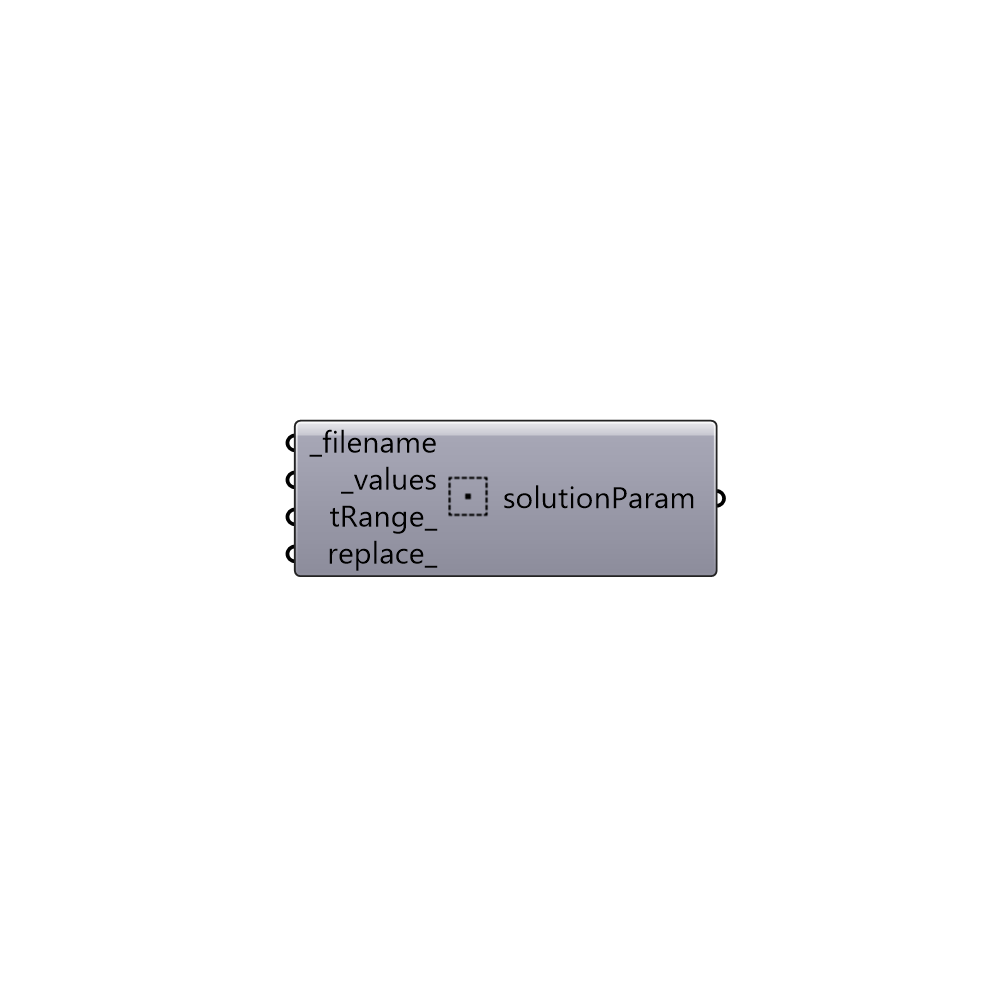

##  Solution Parameter

Solution Parameter.

#### Inputs
* ##### filename [Required]
OpenFOAM filename that the values are belong to (e.g.
 blockMeshDict, fvSchemes).
* ##### values [Required]
new values as a valid OpenFOAM (c++) dictionary.
* ##### tRange [Optional]
Script variable solutionParam
* ##### replace [Optional]
Set to True if you want the original dictionary to be replaced
 by new values. Default is False which means the original dictionary
 will be only updated by new values.

#### Outputs
* ##### solutionParam
A solution parameter.

[Check Hydra Example Files for Solution Parameter](https://hydrashare.github.io/hydra/index.html?keywords=Butterfly_Solution Parameter)