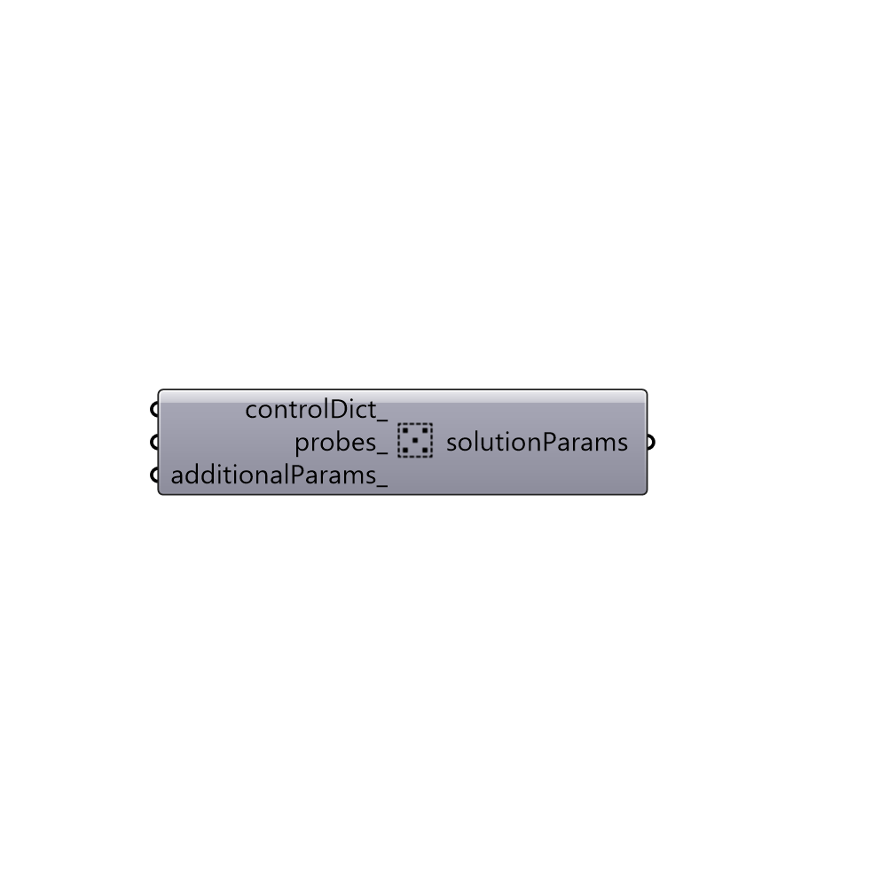

##  Solution Parameters

Solution Parameters.

#### Inputs
* ##### controlDict [Optional]
controlDict.
* ##### probes [Optional]
probes.
* ##### additionalParams [Optional]
List of solution parameters. Use solutionParameter
 component to create solutionParams.

#### Outputs
* ##### solutionParams
A list of solution parameters.

[Check Hydra Example Files for Solution Parameters](https://hydrashare.github.io/hydra/index.html?keywords=Butterfly_Solution Parameters)