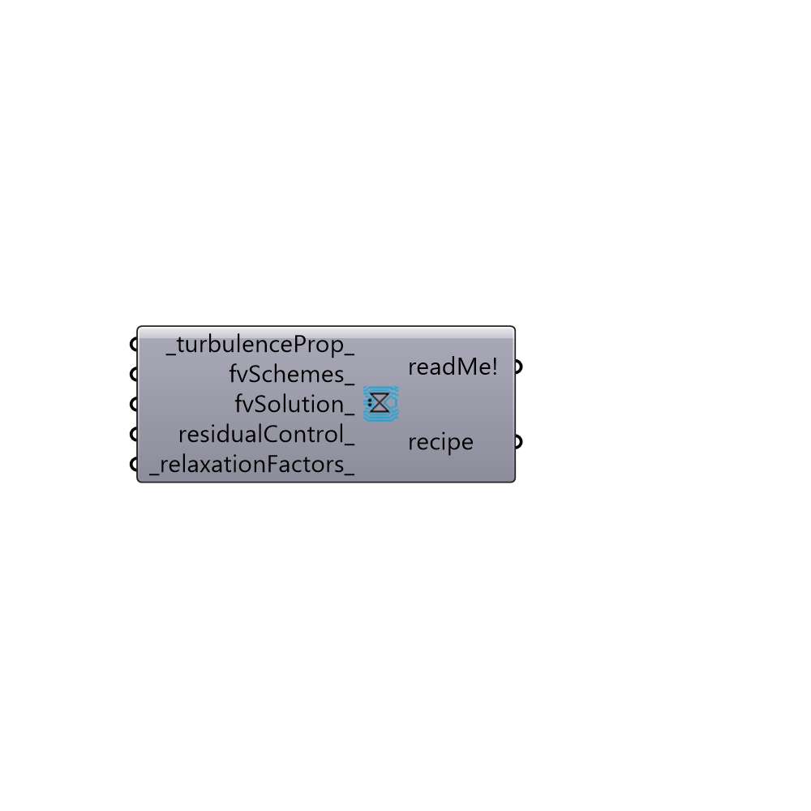

##  Steady Incompressible Recipe

Steady Incompressible Recipe.
 -

#### Inputs
* ##### turbulenceProp [Default]
Turbulence properties. This values will overwrite default
 values, and can be updated while the solution is running.
* ##### fvSchemes [Optional]
Optional input for fvSchemes to overwrite default fvSchemes.
* ##### fvSolution [Optional]
Optional input for fvSolution to overwrite default fvSolution.
* ##### residualControl [Optional]
residualControl values. This values will overwrite default
 values, and can be updated while the solution is running.
* ##### relaxationFactors [Default]
relaxationFactors. This values will overwrite default
 values, and can be updated while the solution is running.

#### Outputs
* ##### readMe!
Reports, errors, warnings, etc.
* ##### recipe
Script variable Python

[Check Hydra Example Files for Steady Incompressible Recipe](https://hydrashare.github.io/hydra/index.html?keywords=Butterfly_Steady Incompressible Recipe)