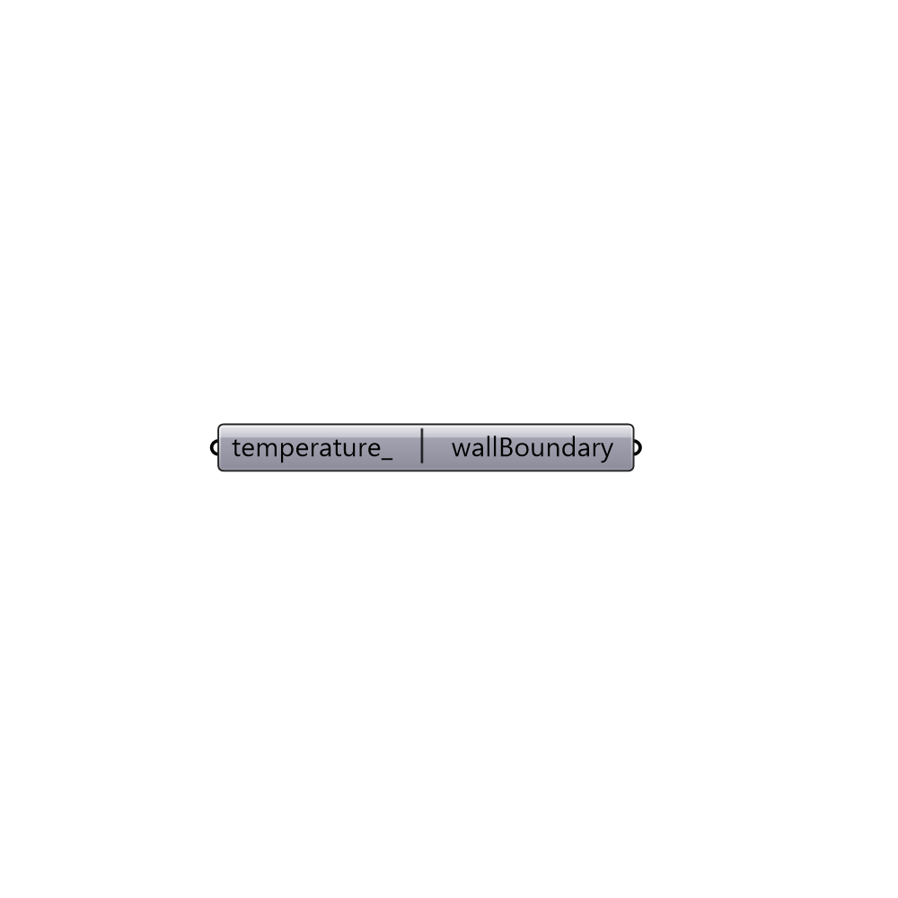

##  Wall Boundary

Create a wall boundary.
 -

#### Inputs
* ##### temperature [Optional]
Temperature in degrees celsius.

#### Outputs
* ##### wallBoundary
Buttefly wall boundary.

[Check Hydra Example Files for Wall Boundary](https://hydrashare.github.io/hydra/index.html?keywords=Butterfly_Wall Boundary)