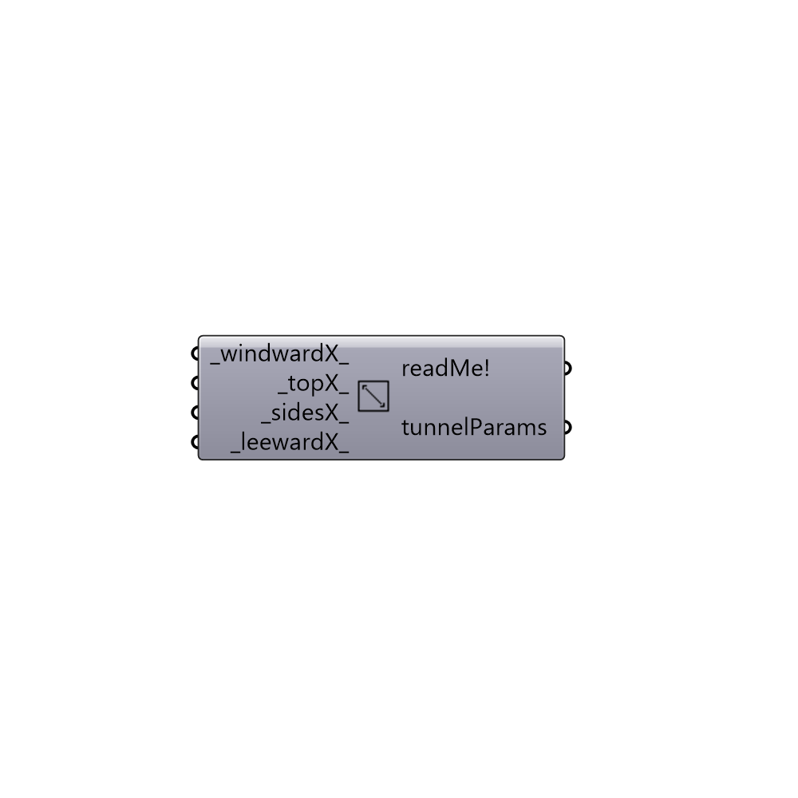

##  Wind Tunnel Parameters

Wind tunnel parameters.
 -

#### Inputs
* ##### windwardX [Default]
Multiplier value for windward extension (default: 3).
* ##### topX [Default]
Multiplier value for top extension (default: 3).
* ##### sidesX [Default]
Script input _sidesX_.
* ##### leewardX [Default]
Multiplier value for leeward extension (default: 15).

#### Outputs
* ##### readMe!
Reports, errors, warnings, etc.
* ##### tunnelParams
Tunnel Parameters

[Check Hydra Example Files for Wind Tunnel Parameters](https://hydrashare.github.io/hydra/index.html?keywords=Butterfly_Wind Tunnel Parameters)