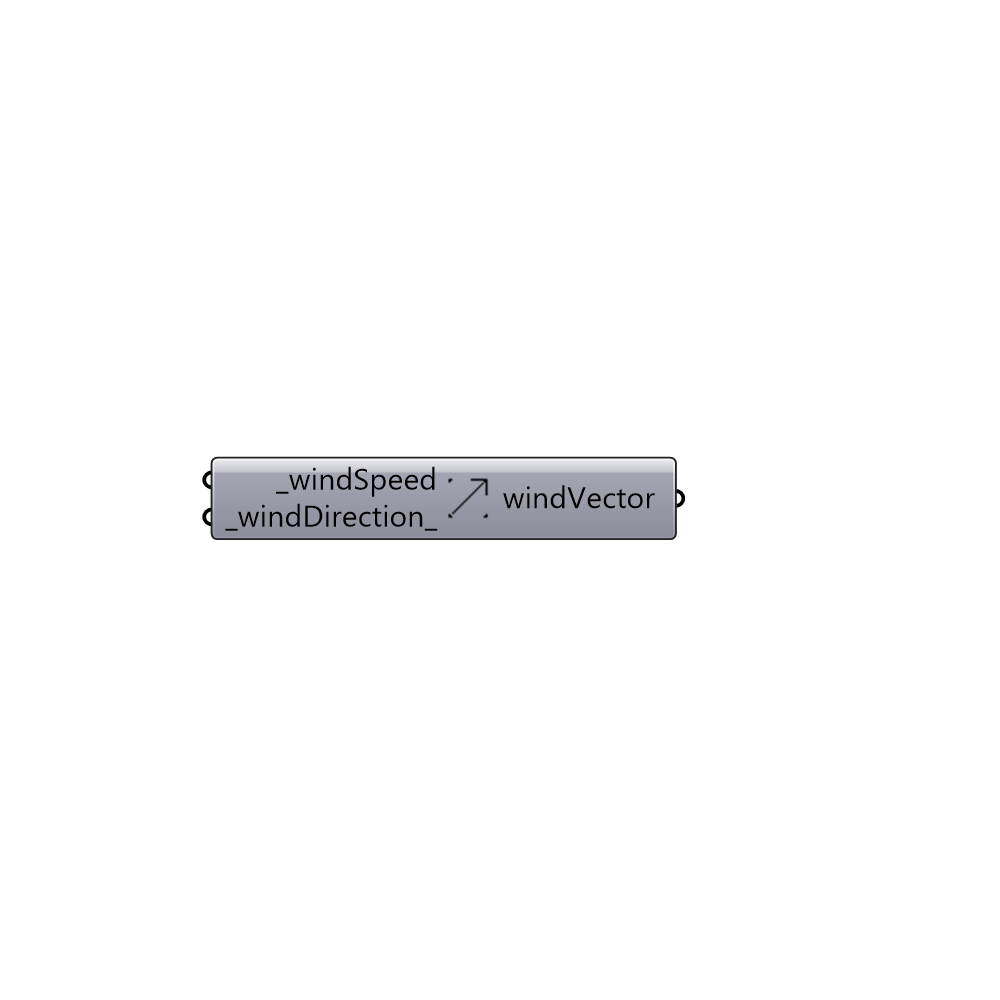

##  Wind Vector

Wind vector.
 -

#### Inputs
* ##### windSpeed [Required]
Wind speed in m/s at a the reference height (_refWindHeight_).
* ##### windDirection [Default]
Wind direction as Vector3D (default: 0, 1, 0).

#### Outputs
* ##### windVector
Wind Vector.

[Check Hydra Example Files for Wind Vector](https://hydrashare.github.io/hydra/index.html?keywords=Butterfly_Wind Vector)