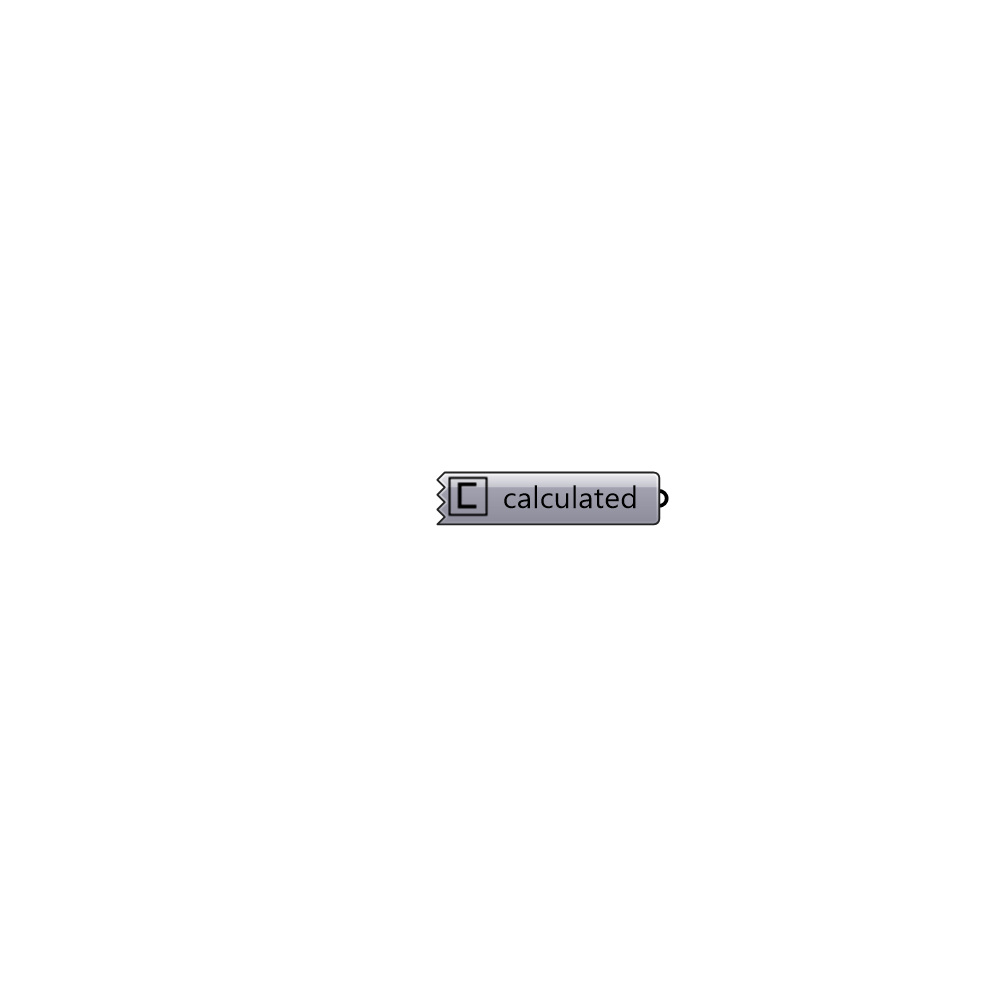

##  calculated

calculated boundary condition.
 -

#### Inputs

#### Outputs
* ##### calculated
calculated boundary condition.

[Check Hydra Example Files for calculated](https://hydrashare.github.io/hydra/index.html?keywords=Butterfly_calculated)