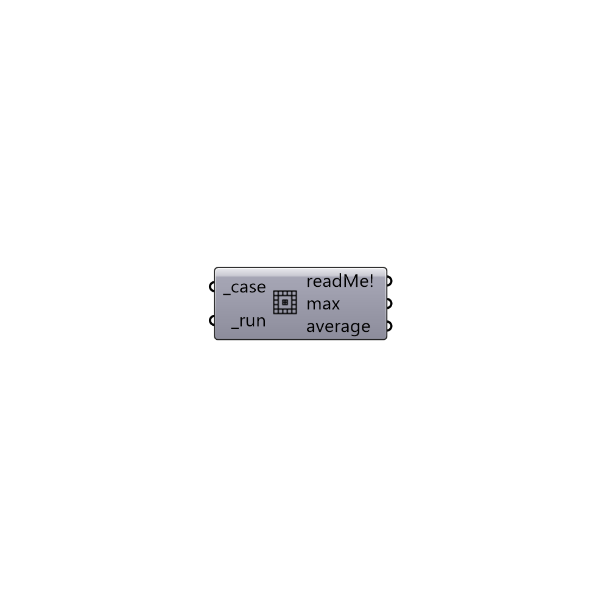

##  chekMesh

chekMesh
 -

#### Inputs
* ##### case [Required]
Butterfly case.
* ##### run [Required]
run chekMesh.

#### Outputs
* ##### readMe!
Reports, errors, warnings, etc.
* ##### max
Maximum mesh non-orthogonality. Use this value to update fvSchemes.
* ##### average
Average mesh non-orthogonality.

[Check Hydra Example Files for chekMesh](https://hydrashare.github.io/hydra/index.html?keywords=Butterfly_chekMesh)