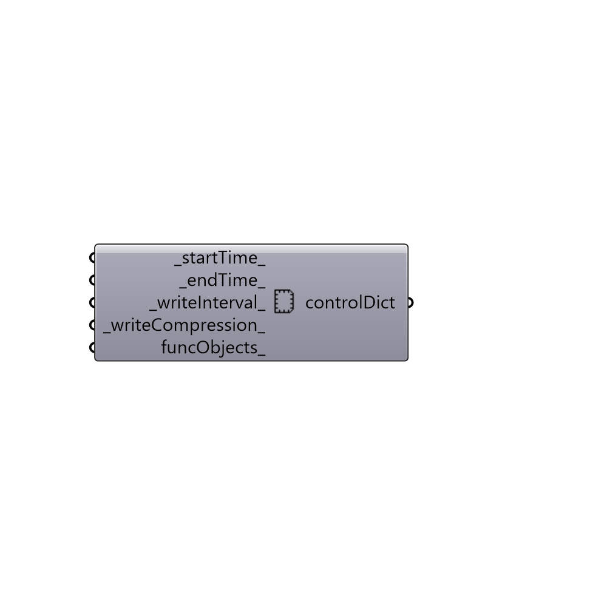

##  controlDict

Set parameters for runDict

#### Inputs
* ##### startTime [Default]
Start timestep (default: 0)
* ##### endTime [Default]
End timestep (default: 1000)
* ##### writeInterval [Default]
Number of intervals between writing the results (default: 100)
* ##### writeCompression [Default]
Set to True if you want the results to be compressed
 before being written to your machine (default: False).
* ##### purgeWrite [Default]
Number of results folder to be kept. 0 means that all the
 result folder will be kept (default: 0).
* ##### funcObjects [Optional]
A list of OpenFOAM function objects. Use functionObject
 component to create a butterfly function object from a cpp dictionary.

#### Outputs
* ##### controlDict
Butterfly controlDict.

[Check Hydra Example Files for controlDict](https://hydrashare.github.io/hydra/index.html?keywords=Butterfly_controlDict)