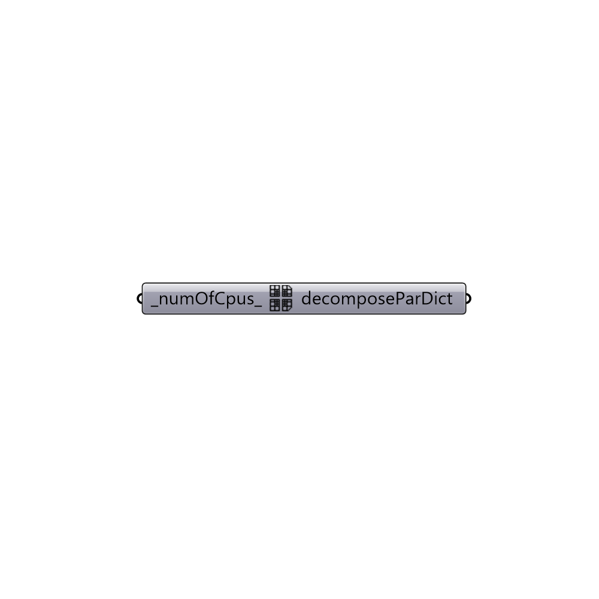

##  decomposeParDict scotch

Scotch decomposeParDict. Dictionary for parallel runs.
 -

#### Inputs
* ##### numOfCpus [Default]
Number of cpus (default: 2).

#### Outputs
* ##### decomposeParDict
decomposeParDict.

[Check Hydra Example Files for decomposeParDict scotch](https://hydrashare.github.io/hydra/index.html?keywords=Butterfly_decomposeParDict scotch)