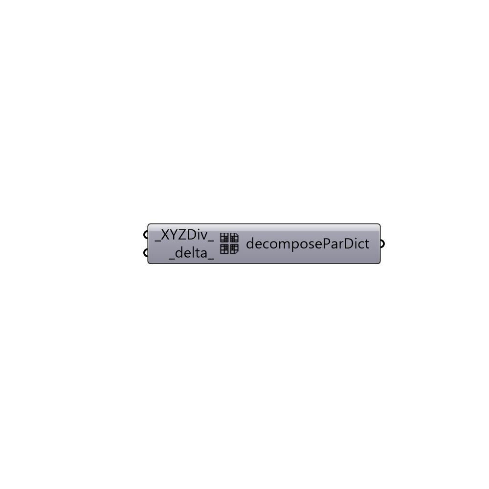

##  decomposeParDict simple

Simple decomposeParDict. Dictionary for parallel runs.
 -

#### Inputs
* ##### XYZDiv [Default]
Number of subdomains in x, y, z as a list (default: (2, 1, 1)).
* ##### delta [Default]
Cell skew factor (default: 0.001).

#### Outputs
* ##### decomposeParDict
decomposeParDict.

[Check Hydra Example Files for decomposeParDict simple](https://hydrashare.github.io/hydra/index.html?keywords=Butterfly_decomposeParDict simple)