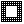
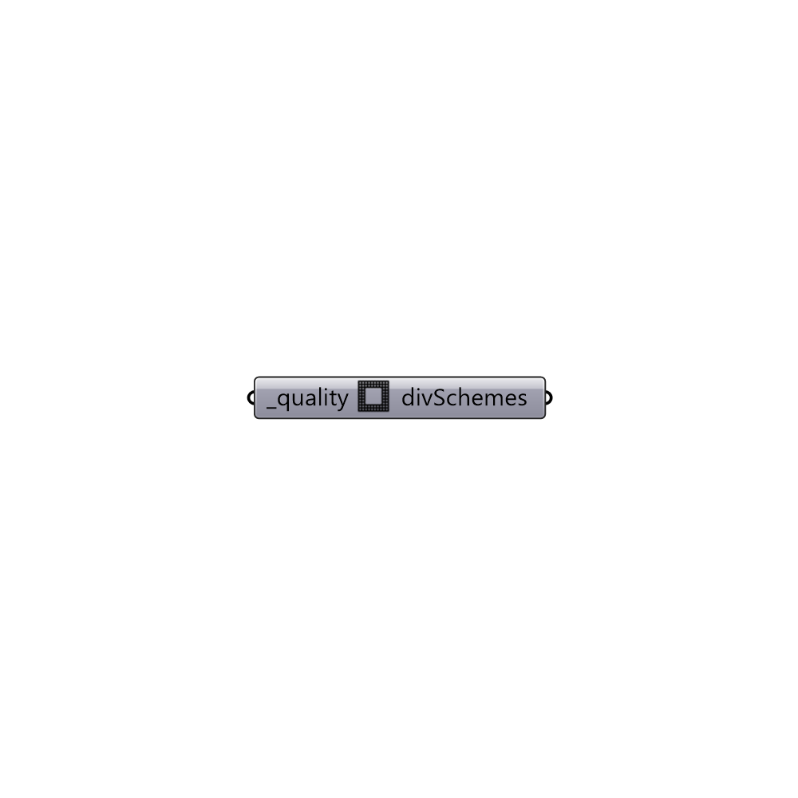

##  divSchemes library

Generate fvSchemes based on mesh non-orthogonalities.
 -

#### Inputs
* ##### quality [Required]
Solution quality [0..1]. The quality 0 generates divSchemes
 which is less accurate but more stable. The quality 1 generates a
 divSchemes that are more accurate but less stable. You can start with
 quality 0 and then change it to quality 1 when the solution is
 converging.

#### Outputs
* ##### divSchemes
Recommended divSchemes. Use solution parameter to update
 fvSchemes for the solution.

[Check Hydra Example Files for divSchemes library](https://hydrashare.github.io/hydra/index.html?keywords=Butterfly_divSchemes library)