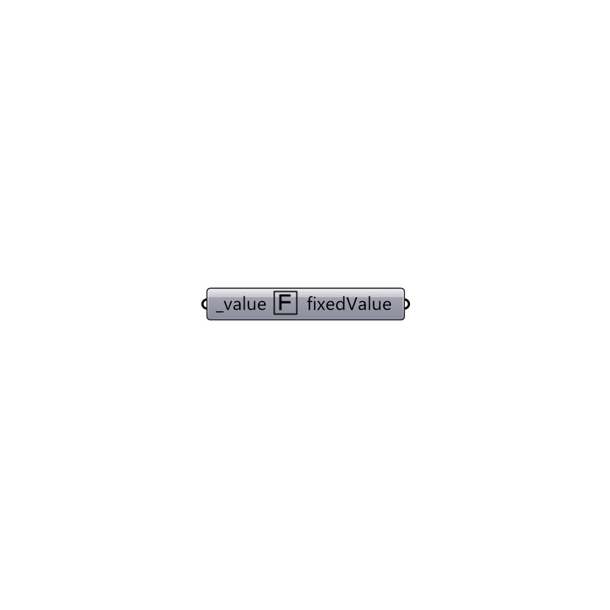

##  fixedValue

fixedValue boundary condition.
 -

#### Inputs
* ##### value [Required]
input value.

#### Outputs
* ##### fixedValue
fixedValue boundary condition.

[Check Hydra Example Files for fixedValue](https://hydrashare.github.io/hydra/index.html?keywords=Butterfly_fixedValue)