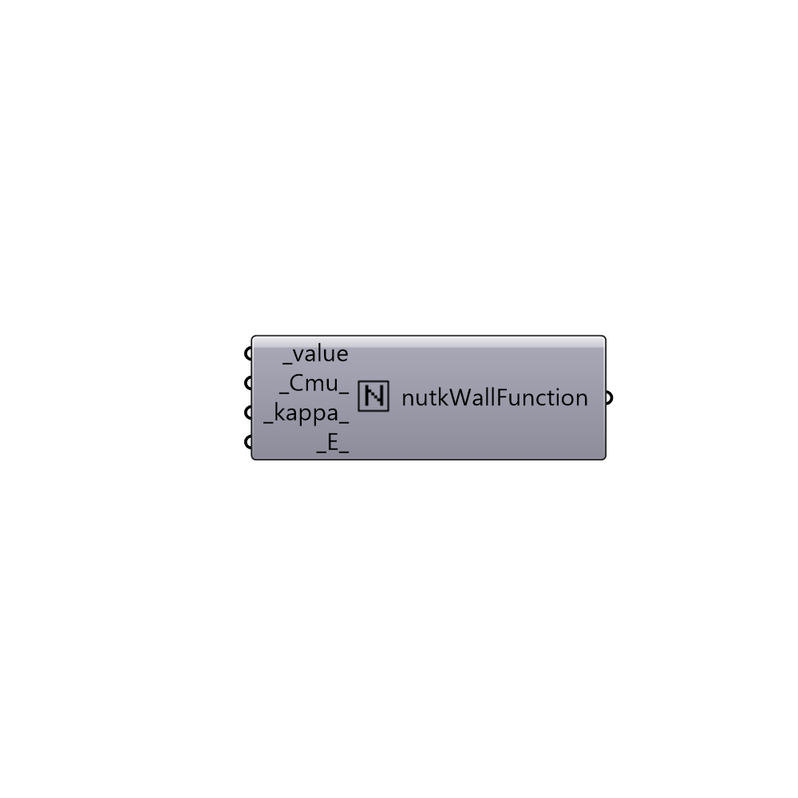

##  nutkWallFunction

nutkWallFunction boundary condition.
 -

#### Inputs
* ##### value [Required]
input value.
* ##### Cmu [Default]
Script variable _Cmu_
* ##### kappa [Default]
Script variable _kappa_
* ##### E [Default]
Script variable _E_

#### Outputs
* ##### nutkWallFunction
nutkWallFunction boundary condition.

[Check Hydra Example Files for nutkWallFunction](https://hydrashare.github.io/hydra/index.html?keywords=Butterfly_nutkWallFunction)