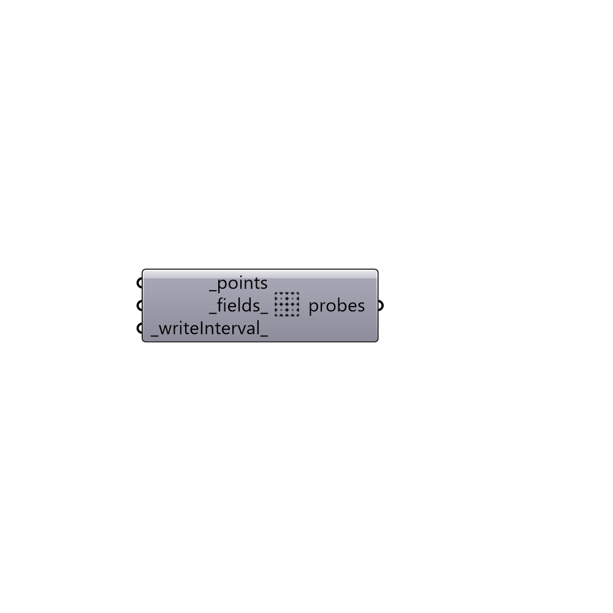

##  probes

Create Butterfly probes

#### Inputs
* ##### points [Required]
A flatten list of points that you're interested to collect the
 values for.
* ##### fields [Default]
A list of fields such as U, p, k (default: U, p).
* ##### writeInterval [Default]
Number of intervals between writing the results (default: 1)

#### Outputs
* ##### probes
Butterfly probes.

[Check Hydra Example Files for probes](https://hydrashare.github.io/hydra/index.html?keywords=Butterfly_probes)