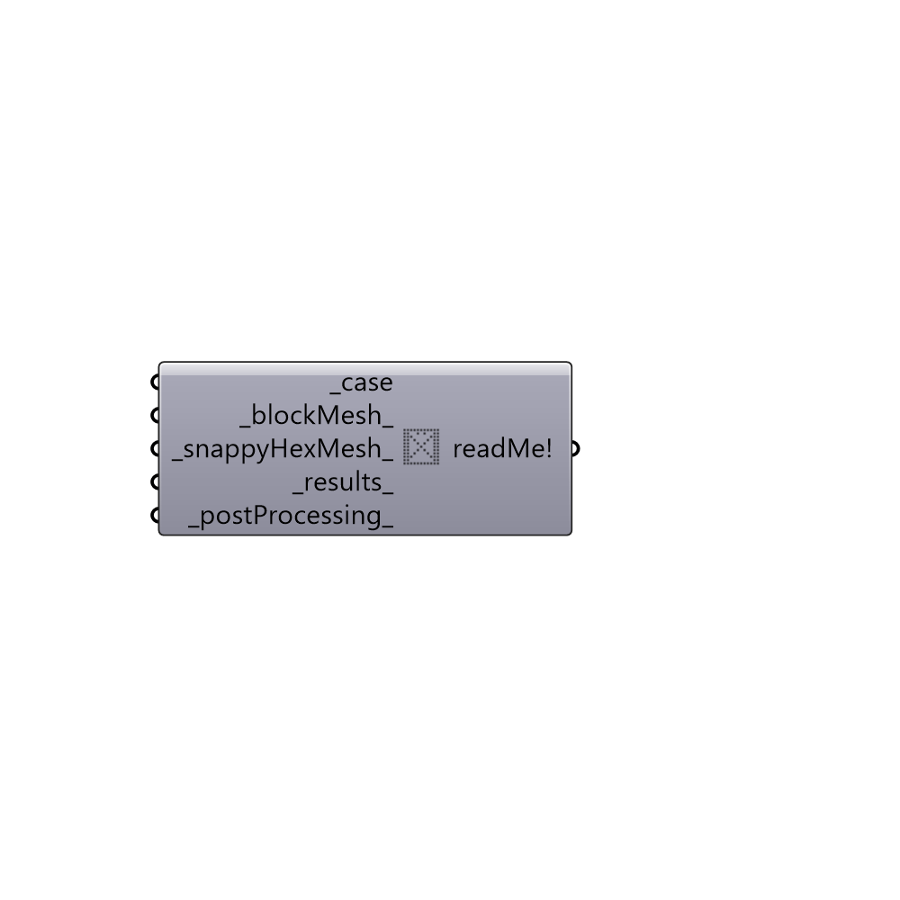

##  purgeCase

Purge case folder.
 -

#### Inputs
* ##### case [Required]
Butterfly case.
* ##### blockMesh [Default]
Set to True to erase the files inside constant/polyMesh folder.
* ##### snappyHexMesh [Default]
Set to True to remove mesh folders generated by snappyHexMesh.
* ##### results [Default]
Set to True to remove result folders.
* ##### postProcessing [Default]
Set to True to remove postProcessing folder.

#### Outputs
* ##### readMe!
The execution information, as output and error streams

[Check Hydra Example Files for purgeCase](https://hydrashare.github.io/hydra/index.html?keywords=Butterfly_purgeCase)