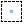
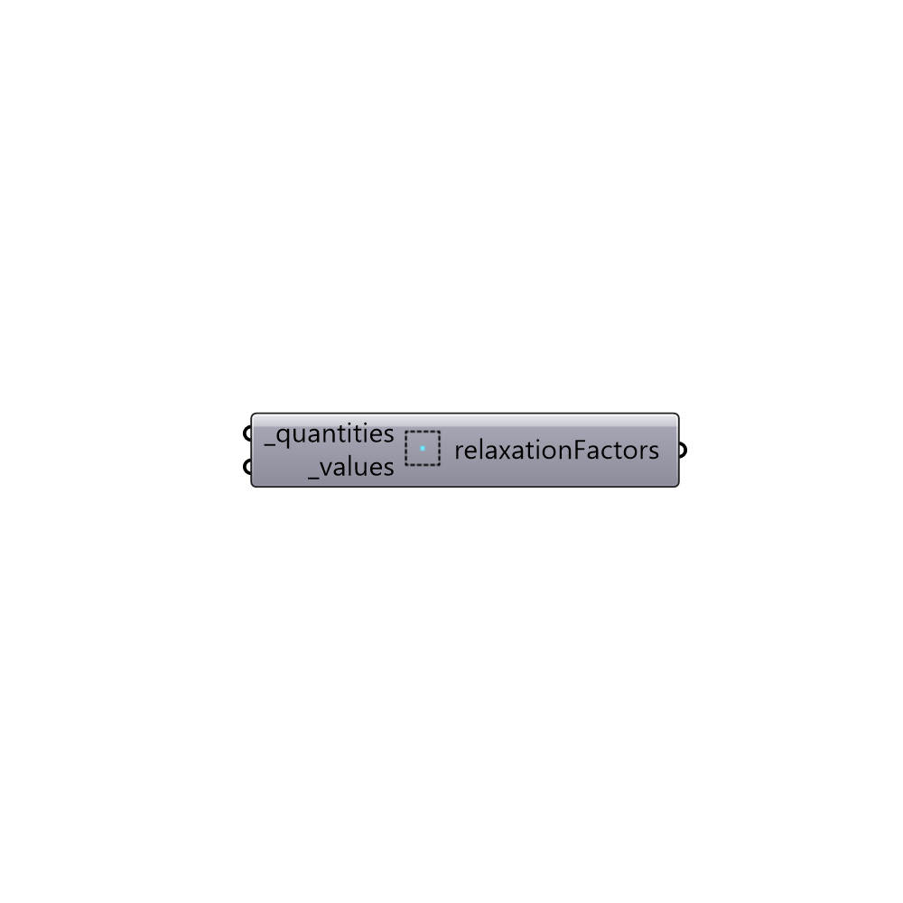

##  relaxtionFactors

Set relaxtionFactors values

#### Inputs
* ##### quantities [Required]
Script variable _quantities
* ##### values [Required]
relaxtionValues

#### Outputs
* ##### relaxationFactors
Relaxation factors.

[Check Hydra Example Files for relaxtionFactors](https://hydrashare.github.io/hydra/index.html?keywords=Butterfly_relaxtionFactors)