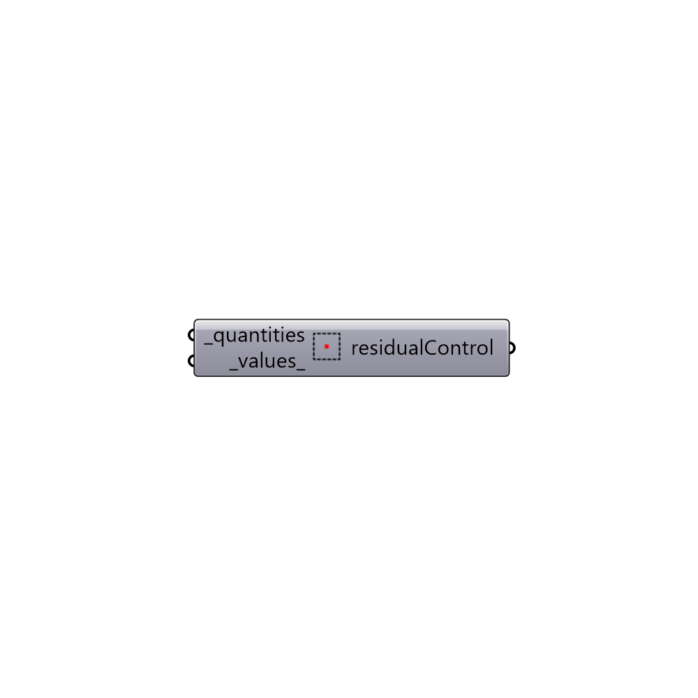

##  residualControl

Set residual control convergance values

#### Inputs
* ##### quantities [Required]
Script variable _quantities
* ##### values [Default]
Residual control valeus for quantities (default: 1e-5)

#### Outputs
* ##### residualControl
Residual Control.

[Check Hydra Example Files for residualControl](https://hydrashare.github.io/hydra/index.html?keywords=Butterfly_residualControl)