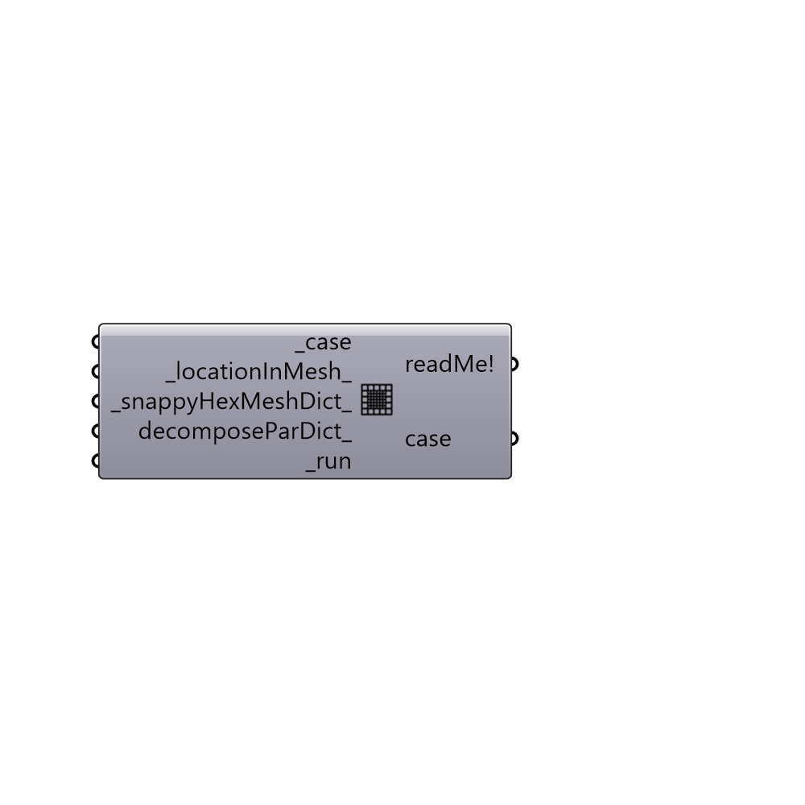

##  snappyHexMesh

snappyHexMesh
 -

#### Inputs
* ##### case [Required]
Butterfly case.
* ##### locationInMesh [Default]
A point 3d to locate the volume that should be meshed. By default center of the boundingbox will be used.
* ##### snappyHexMeshDict [Default]
optional modified snappyHexMeshDict.
* ##### decomposeParDict [Optional]
decomposeParDict for running snappyHexMesh in parallel.
* ##### run [Required]
run snappyHexMesh.

#### Outputs
* ##### readMe!
Reports, errors, warnings, etc.
* ##### case
Butterfly case.

[Check Hydra Example Files for snappyHexMesh](https://hydrashare.github.io/hydra/index.html?keywords=Butterfly_snappyHexMesh)